# S&P500和NASDAQ收益分析
数据源：yfinance  
https://pypi.org/project/yfinance/  
以下图表通过[analyze.py](analyze.py)脚本处理并生成。

## 总结
拿满30年，美股的年化收益约为7%-10%左右。  
定投策略是每个月投入固定金额。梭哈策略是在一开始投入所有金额。

### 投资周期对收益的影响
时间周期越长，投资收益越稳定。无论是 S&P 500 还是 NASDAQ，随着投资周期的延长，年化收益率的波动性逐渐降低。特别是在 30 年周期中，梭哈策略的最小收益和最大收益之间的差距显著缩小，表明长期投资更容易平滑市场波动带来的影响。

### 梭哈策略与定投策略的对比
梭哈策略在不同时间周期内的平均年化收益率和中位数年化收益率普遍高于定投策略。这意味着在这两个市场中，一次性投资通常能带来更高的长期回报。然而，梭哈策略也具有更大的波动性，尤其在较短的投资周期中，可能面临更大的亏损风险。  
定投策略的年化收益率虽然略低于梭哈策略，但其波动性较小，特别是在10年和20年的投资周期中，定投策略的最小年化收益率通常高于梭哈策略。这表明定投在平衡风险和收益方面具有优势，特别适合风险承受能力较低的投资者或面临不确定市场环境时。

### 不同市场表现的差异
NASDAQ市场的收益率普遍高于 S&P 500。无论是在梭哈还是定投策略下，NASDAQ 的平均年化收益率和最大年化收益率都显著高于 S&P 500。这反映了科技股在过去几十年中的强劲表现。  
然而，NASDAQ市场也表现出更大的波动性，特别是在短期（10年）投资中，最小年化收益率可能为负。因此，虽然 NASDAQ 提供了更高的收益潜力，但也伴随着更高的风险。

## 投资策略建议
对于长期投资者（20年及以上）：梭哈策略可能是更优选择，特别是在对未来市场前景充满信心的情况下。然而，定投策略仍然是管理风险的有效工具，特别是在市场不确定性较大时。
对于中短期投资者（10-20年）：定投策略可能更具吸引力，因为它可以更好地管理波动性，提供更稳定的回报。
在市场选择上，高风险承受能力的投资者可以更多地关注 NASDAQ 市场，而希望更稳定回报的投资者则可以将重点放在 S&P 500 上。

## 详细数据
下面的图中是从某一年开始，使用梭哈或定投的策略，拿满10年，20年，30年的收益。横坐标是起始年份，纵坐标是年化收益百分比。

### 10年收益
#### S&P500
##### 梭哈
平均年化收益：6.48%，中位数年化收益：7.71%，最小年化收益：-7.38%，最大年化收益：15.62%
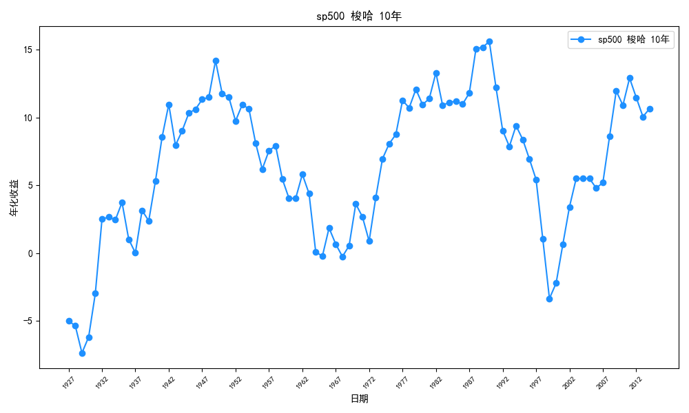

##### 定投
平均年化收益：3.71%，中位数年化收益：4.06%，最小年化收益：-2.12%，最大年化收益：10.10%
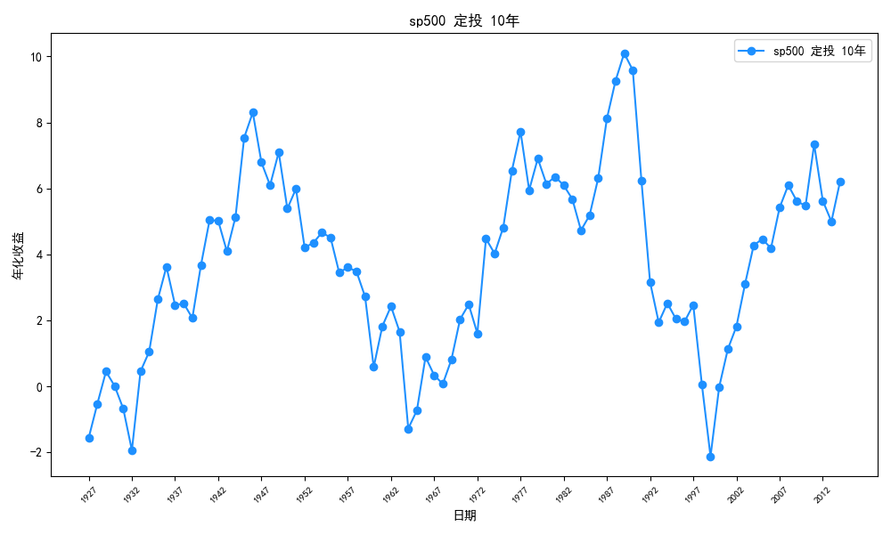

#### NASDAQ
##### 梭哈
平均年化收益：10.73%，中位数年化收益：10.95%，最小年化收益：-4.54%，最大年化收益：24.81%
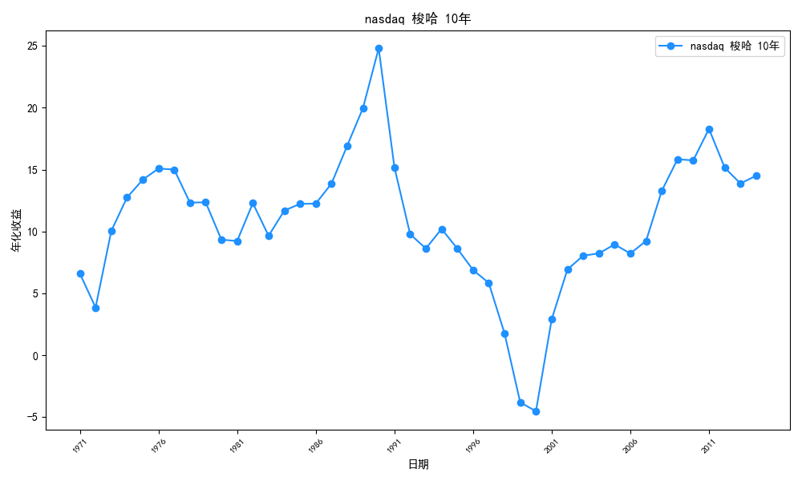

##### 定投
平均年化收益：6.17%，中位数年化收益：6.56%，最小年化收益：-1.24%，最大年化收益：15.65%
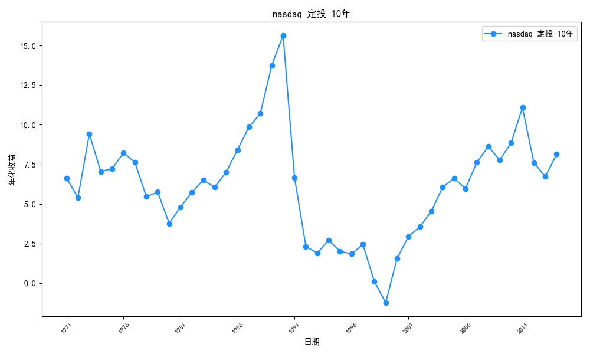

### 20年收益
#### S&P500
##### 梭哈
平均年化收益：6.76%，中位数年化收益：6.93%，最小年化收益：-2.64%，最大年化收益：13.63%
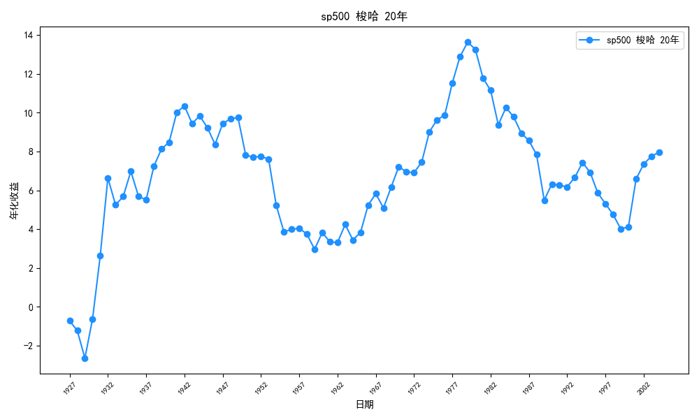

##### 定投
平均年化收益：4.07%，中位数年化收益：4.28%，最小年化收益：0.89%，最大年化收益：8.72%
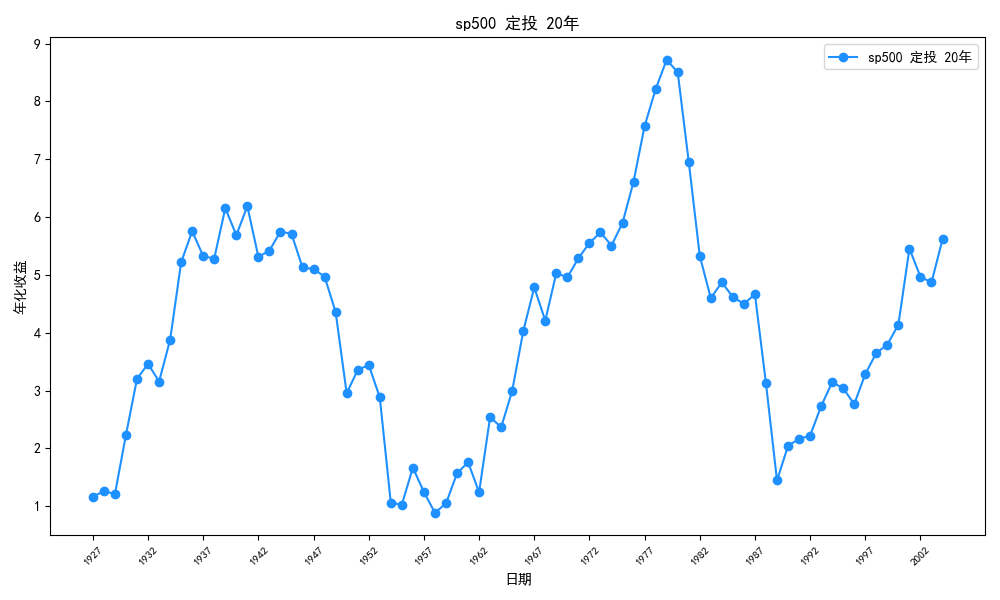

#### NASDAQ
##### 梭哈
平均年化收益：10.16%，中位数年化收益：9.65%，最小年化收益：5.10%，最大年化收益：16.80%
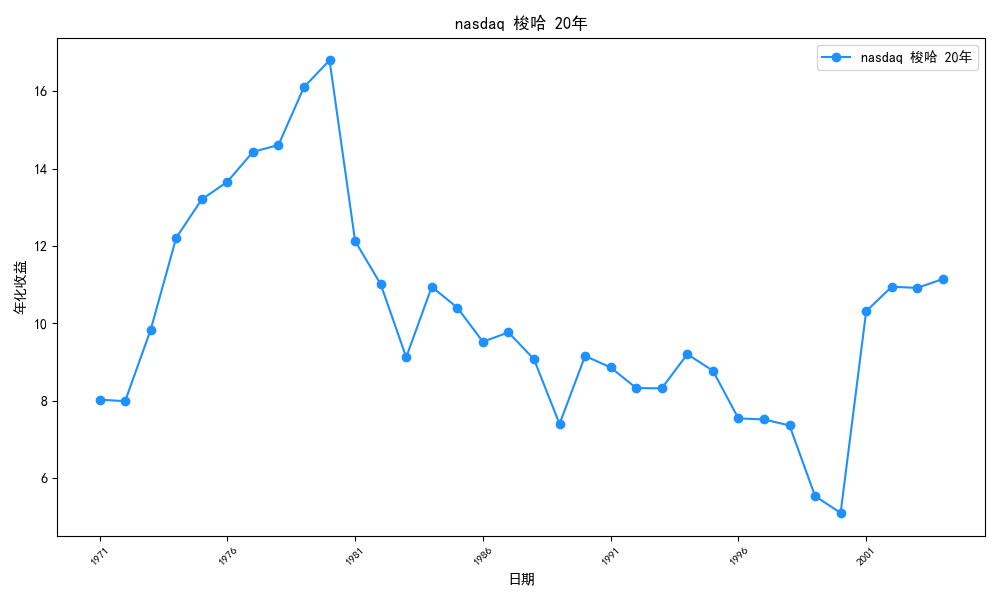

##### 定投
平均年化收益：6.09%，中位数年化收益：5.65%，最小年化收益：2.59%，最大年化收益：11.46%
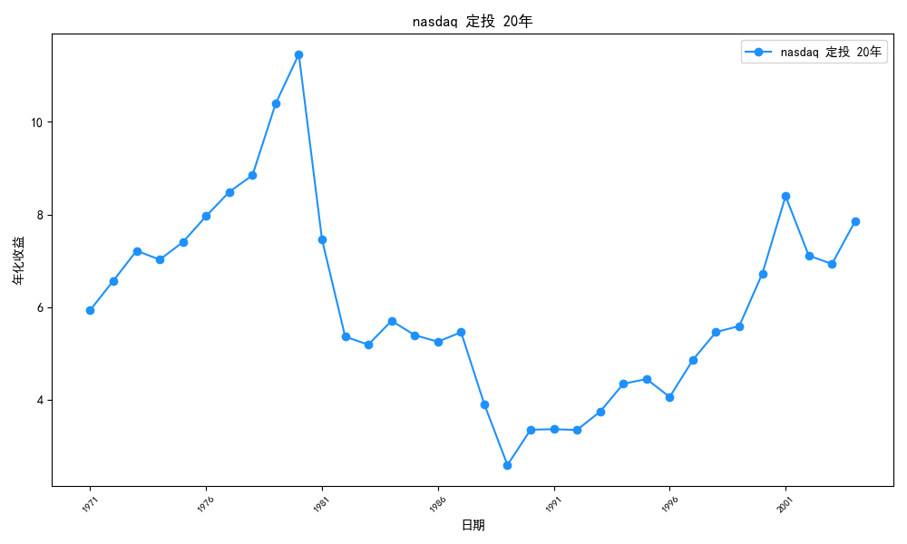

### 30年收益
#### S&P500
##### 梭哈
平均年化收益：7.04%，中位数年化收益：7.34%，最小年化收益：2.68%，最大年化收益：9.95%
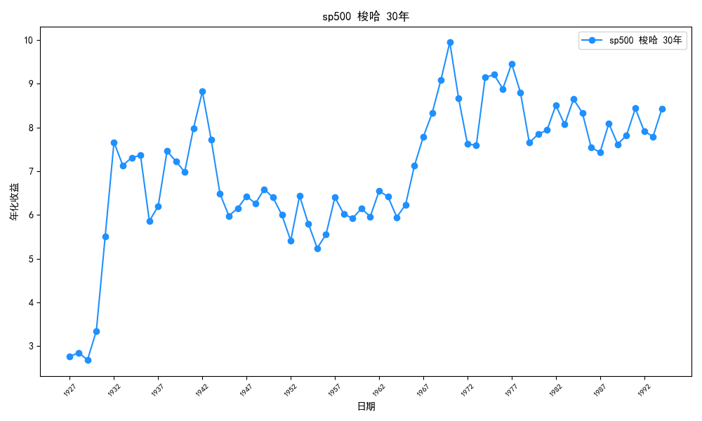

##### 定投
平均年化收益：4.32%，中位数年化收益：4.26%，最小年化收益：2.02%，最大年化收益：7.32%
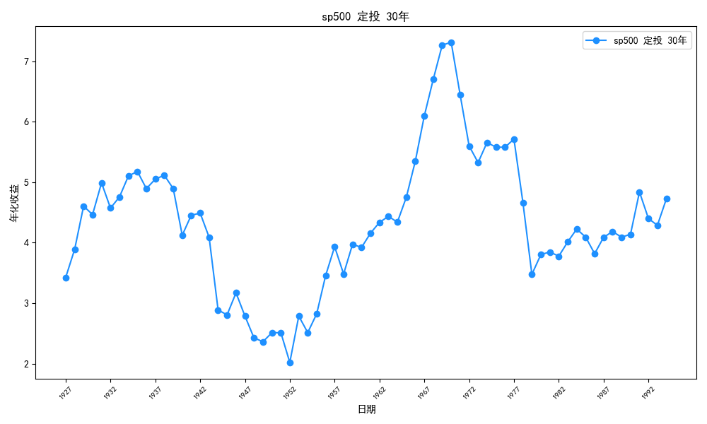

#### NASDAQ
##### 梭哈
平均年化收益：10.16%，中位数年化收益：10.14%，最小年化收益：8.59%，最大年化收益：11.92%
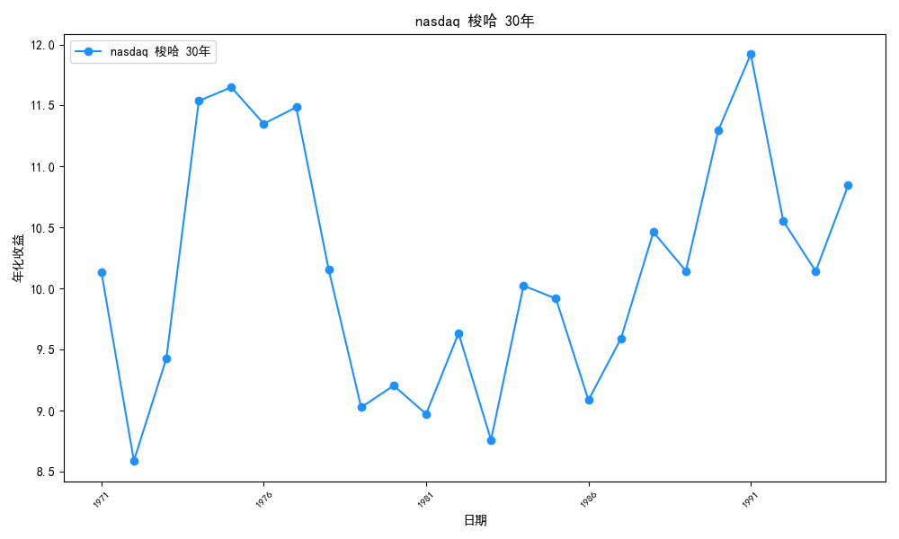

##### 定投
平均年化收益：5.92%，中位数年化收益：6.00%，最小年化收益：4.31%，最大年化收益：7.51%
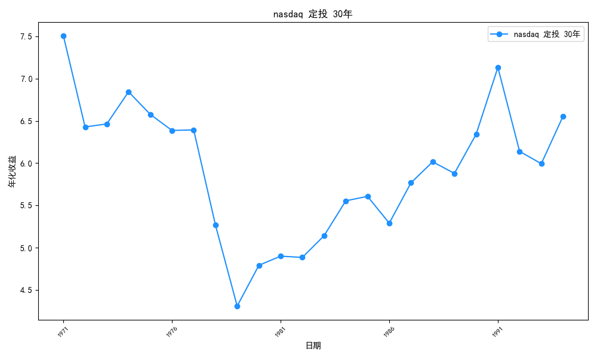
