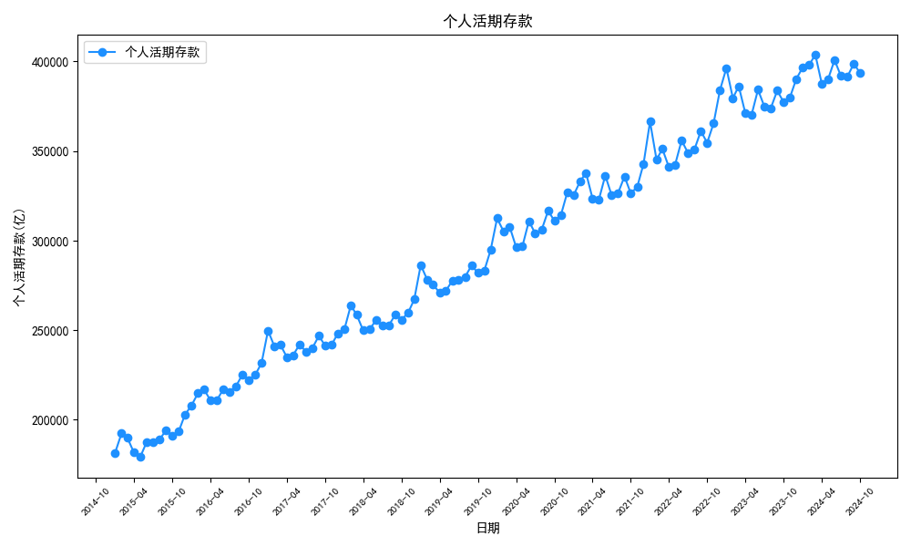
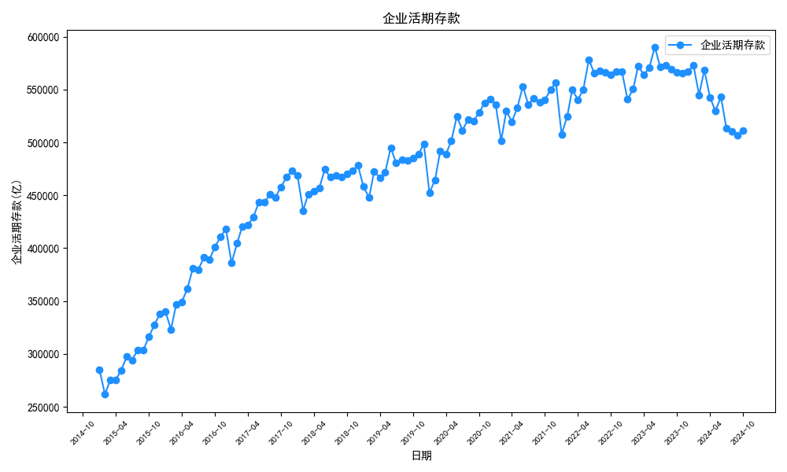
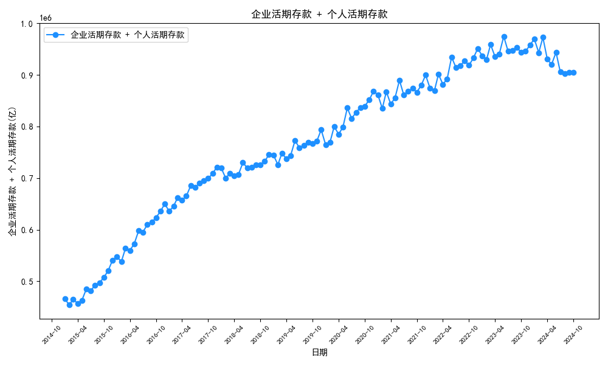
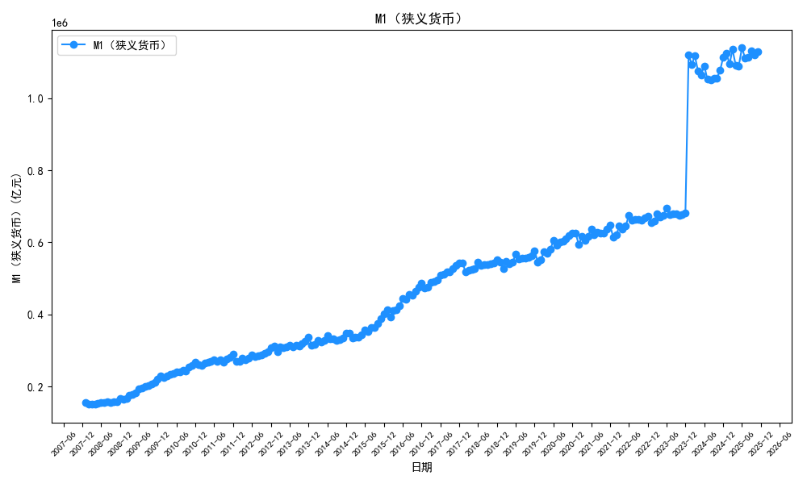
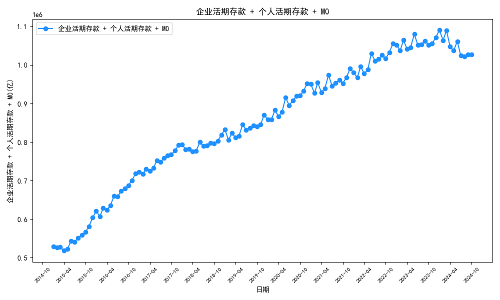

# 活期存款分析
数据源：http://www.pbc.gov.cn/diaochatongjisi/116219/116319/5225358/5225362/index.html

居民部门：金融机构信贷收支统计/存款类金融机构人民币信贷收支表

企业部门：货币统计概览/存款行公司概览

## 个人活期存款

## 企业活期存款

## 企业活期存款 + 个人活期存款

## M1

## 企业活期存款 + 个人活期存款 + M0

## 原始数据（万亿）
| 日期      | 个人活期存款   | 单位活期存款   | m0      | 个人活期同比   | 单位活期同比   | m0_yoy   | 单位个人合计   | 单位个人合计同比   | m1     | m1_yoy   | 单位个人M0合计    | 单位个人M0合计同比   |
|:--------|:---------|:---------|:--------|:---------|:---------|:---------|:---------|:-----------|:-------|:---------|:------------|:-------------|
| 2024-10 | 393623   | 510910   | 122447  | 4.30%    | -9.75%   | 12.79%   | 904534   | -4.13%     | 633357 | -6.13%   | 1.02698e+06 | -2.39%       |
| 2024-09 | 398742   | 506407   | 121830  | 3.91%    | -11.03%  | 11.51%   | 905149   | -5.01%     | 628237 | -7.40%   | 1.02698e+06 | -3.31%       |
| 2024-08 | 391493   | 510766   | 119473  | 4.70%    | -10.87%  | 12.16%   | 902258   | -4.72%     | 630238 | -7.26%   | 1.02173e+06 | -3.01%       |
| 2024-07 | 392005   | 513456   | 118840  | 4.53%    | -10.09%  | 11.98%   | 905461   | -4.30%     | 632297 | -6.63%   | 1.0243e+06  | -2.65%       |
| 2024-06 | 400812   | 542874   | 117737  | 4.31%    | -8.01%   | 11.68%   | 943685   | -3.16%     | 660611 | -5.03%   | 1.06142e+06 | -1.71%       |
| 2024-05 | 390152   | 529780   | 117063  | 5.42%    | -7.14%   | 11.75%   | 919931   | -2.19%     | 646842 | -4.21%   | 1.03699e+06 | -0.80%       |
| 2024-04 | 387529   | 542755   | 117311  | 4.36%    | -3.74%   | 10.77%   | 930285   | -0.53%     | 660066 | -1.45%   | 1.0476e+06  | 0.62%        |
| 2024-03 | 403890   | 568598   | 117210  | 4.58%    | -0.68%   | 11.00%   | 972488   | 1.44%      | 685809 | 1.14%    | 1.0897e+06  | 2.39%        |
| 2024-02 | 398070   | 544906   | 121010  | 4.88%    | -0.99%   | 12.46%   | 942976   | 1.41%      | 665916 | 1.21%    | 1.06399e+06 | 2.55%        |
| 2024-01 | 396695   | 572799   | 121399  | 0.09%    | 5.95%    | 5.93%    | 969494   | 3.47%      | 694198 | 5.95%    | 1.09089e+06 | 3.74%        |
| 2023-12 | 390266   | 567098   | 113445  | 1.66%    | 0.02%    | 8.35%    | 957364   | 0.68%      | 680543 | 1.32%    | 1.07081e+06 | 1.44%        |
| 2023-11 | 380040   | 565678   | 110225  | 3.96%    | -0.29%   | 10.51%   | 945718   | 1.38%      | 675903 | 1.33%    | 1.05594e+06 | 2.26%        |
| 2023-10 | 377405   | 566131   | 108565  | 6.43%    | 0.43%    | 10.31%   | 943536   | 2.74%      | 674696 | 1.90%    | 1.0521e+06  | 3.48%        |
| 2023-09 | 383736   | 569190   | 109253  | 6.24%    | 0.59%    | 10.72%   | 952926   | 2.79%      | 678444 | 2.09%    | 1.06218e+06 | 3.55%        |
| 2023-08 | 373901   | 573073   | 106515  | 6.57%    | 1.00%    | 9.55%    | 946974   | 3.13%      | 679588 | 2.25%    | 1.05349e+06 | 3.75%        |
| 2023-07 | 375019   | 571089   | 106130  | 7.45%    | 1.02%    | 9.97%    | 946108   | 3.47%      | 677219 | 2.32%    | 1.05224e+06 | 4.09%        |
| 2023-06 | 384261   | 590176   | 105419  | 7.95%    | 2.04%    | 9.80%    | 974437   | 4.29%      | 695595 | 3.15%    | 1.07986e+06 | 4.81%        |
| 2023-05 | 370076   | 570496   | 104757  | 8.06%    | 3.81%    | 9.64%    | 940572   | 5.44%      | 675253 | 4.67%    | 1.04533e+06 | 5.85%        |
| 2023-04 | 371355   | 563857   | 105904  | 8.87%    | 4.32%    | 10.75%   | 935212   | 6.08%      | 669762 | 5.29%    | 1.04112e+06 | 6.54%        |
| 2023-03 | 386220   | 572468   | 105591  | 9.98%    | 4.10%    | 10.98%   | 958688   | 6.39%      | 678060 | 5.12%    | 1.06428e+06 | 6.83%        |
| 2023-02 | 379554   | 550336   | 107603  | 9.95%    | 4.95%    | 10.67%   | 929890   | 6.93%      | 657939 | 5.84%    | 1.03749e+06 | 7.31%        |
| 2023-01 | 396349   | 540613   | 114601  | 8.16%    | 6.49%    | 7.92%    | 936962   | 7.19%      | 655214 | 6.74%    | 1.05156e+06 | 7.27%        |
| 2022-12 | 383900   | 566969   | 104706  | 11.96%   | 1.86%    | 15.28%   | 950868   | 5.71%      | 671675 | 3.74%    | 1.05557e+06 | 6.59%        |
| 2022-11 | 365579   | 567302   | 99740.1 | 10.76%   | 3.14%    | 14.08%   | 932881   | 6.00%      | 667043 | 4.64%    | 1.03262e+06 | 6.73%        |
| 2022-10 | 354605   | 563724   | 98416.7 | 8.65%    | 4.39%    | 14.32%   | 918329   | 6.00%      | 662141 | 5.76%    | 1.01675e+06 | 6.75%        |
| 2022-09 | 361207   | 565863   | 98672.1 | 7.56%    | 5.22%    | 13.59%   | 927071   | 6.12%      | 664535 | 6.39%    | 1.02574e+06 | 6.79%        |
| 2022-08 | 350840   | 567374   | 97231   | 7.45%    | 4.76%    | 14.31%   | 918214   | 5.77%      | 664605 | 6.06%    | 1.01544e+06 | 6.53%        |
| 2022-07 | 349029   | 565323   | 96509.2 | 7.22%    | 5.54%    | 13.92%   | 914352   | 6.17%      | 661832 | 6.68%    | 1.01086e+06 | 6.87%        |
| 2022-06 | 355958   | 578364   | 96011.2 | 5.83%    | 4.56%    | 13.83%   | 934321   | 5.04%      | 674375 | 5.79%    | 1.03033e+06 | 5.80%        |
| 2022-05 | 342458   | 549561   | 95546.9 | 6.12%    | 3.17%    | 13.51%   | 892019   | 4.29%      | 645108 | 4.58%    | 987566      | 5.11%        |
| 2022-04 | 341103   | 540513   | 95626.5 | 5.39%    | 4.02%    | 11.45%   | 881615   | 4.55%      | 636139 | 5.07%    | 977242      | 5.19%        |
| 2022-03 | 351188   | 549922   | 95141.9 | 3.97%    | 3.84%    | 9.94%    | 901110   | 3.89%      | 645064 | 4.70%    | 996252      | 4.44%        |
| 2022-02 | 345201   | 524384   | 97227.7 | 3.62%    | 4.55%    | 5.77%    | 869586   | 4.18%      | 621612 | 4.74%    | 966813      | 4.34%        |
| 2022-01 | 366449   | 507670   | 106189  | 12.61%   | -5.27%   | 18.48%   | 874120   | 1.48%      | 613859 | -1.87%   | 980309      | 3.08%        |
| 2021-12 | 342904   | 556618   | 90825.1 | 4.94%    | 2.84%    | 7.72%    | 899522   | 3.63%      | 647443 | 3.49%    | 990347      | 3.99%        |
| 2021-11 | 330054   | 550049   | 87433.4 | 5.03%    | 2.42%    | 7.16%    | 880102   | 3.38%      | 637482 | 3.05%    | 967536      | 3.71%        |
| 2021-10 | 326379   | 539996   | 86085.8 | 4.93%    | 2.24%    | 6.23%    | 866375   | 3.24%      | 626082 | 2.77%    | 952461      | 3.50%        |
| 2021-09 | 335834   | 537779   | 86867.1 | 6.03%    | 3.43%    | 5.46%    | 873612   | 4.42%      | 624646 | 3.71%    | 960479      | 4.51%        |
| 2021-08 | 326515   | 541599   | 85059.2 | 6.70%    | 3.90%    | 6.27%    | 868115   | 4.94%      | 626659 | 4.22%    | 953174      | 5.06%        |
| 2021-07 | 325537   | 535649   | 84717.6 | 7.06%    | 4.76%    | 6.07%    | 861186   | 5.62%      | 620367 | 4.93%    | 945904      | 5.66%        |
| 2021-06 | 336356   | 553132   | 84347   | 8.18%    | 5.39%    | 6.15%    | 889488   | 6.43%      | 637479 | 5.49%    | 973835      | 6.40%        |
| 2021-05 | 322702   | 532651   | 84177.7 | 8.70%    | 6.23%    | 5.61%    | 855352   | 7.15%      | 616828 | 6.15%    | 939530      | 7.01%        |
| 2021-04 | 323644   | 519619   | 85803.4 | 9.19%    | 6.33%    | 5.30%    | 843262   | 7.41%      | 605422 | 6.19%    | 929066      | 7.22%        |
| 2021-03 | 337787   | 529570   | 86543.6 | 9.76%    | 7.63%    | 4.24%    | 867356   | 8.45%      | 616113 | 7.14%    | 953900      | 8.05%        |
| 2021-02 | 333151   | 501563   | 91924.6 | 9.18%    | 7.98%    | 4.24%    | 834713   | 8.45%      | 593487 | 7.38%    | 926638      | 8.02%        |
| 2021-01 | 325421   | 535939   | 89625.2 | 4.14%    | 18.50%   | -3.89%   | 861359   | 12.63%     | 625564 | 14.67%   | 950985      | 10.84%       |
| 2020-12 | 326763   | 541266   | 84314.5 | 10.88%   | 8.51%    | 9.23%    | 868029   | 9.39%      | 625581 | 8.61%    | 952344      | 9.37%        |
| 2020-11 | 314250   | 537039   | 81593.6 | 10.92%   | 9.93%    | 10.30%   | 851289   | 10.29%     | 618632 | 9.98%    | 932882      | 10.29%       |
| 2020-10 | 311033   | 528146   | 81036.4 | 10.27%   | 8.95%    | 10.41%   | 839179   | 9.44%      | 609182 | 9.14%    | 920215      | 9.52%        |
| 2020-09 | 316730   | 519941   | 82370.9 | 10.69%   | 7.65%    | 11.12%   | 836671   | 8.78%      | 602312 | 8.11%    | 919042      | 8.99%        |
| 2020-08 | 306013   | 521246   | 80042.7 | 9.36%    | 7.77%    | 9.42%    | 827259   | 8.36%      | 601289 | 7.99%    | 907302      | 8.45%        |
| 2020-07 | 304072   | 511325   | 79867.2 | 9.29%    | 6.45%    | 9.87%    | 815397   | 7.49%      | 591193 | 6.90%    | 895265      | 7.70%        |
| 2020-06 | 310920   | 524859   | 79459.4 | 11.96%   | 6.01%    | 9.48%    | 835778   | 8.15%      | 604318 | 6.45%    | 915238      | 8.26%        |
| 2020-05 | 296882   | 501404   | 79706.8 | 9.16%    | 6.33%    | 9.49%    | 798286   | 7.36%      | 581111 | 6.75%    | 877993      | 7.55%        |
| 2020-04 | 296393   | 488665   | 81485.2 | 9.33%    | 4.72%    | 10.17%   | 785058   | 6.41%      | 570150 | 5.46%    | 866544      | 6.76%        |
| 2020-03 | 307747   | 492028   | 83022.2 | 11.77%   | 4.10%    | 10.78%   | 799775   | 6.93%      | 575050 | 5.02%    | 882797      | 7.28%        |
| 2020-02 | 305149   | 464514   | 88187.1 | 9.69%    | 3.75%    | 10.95%   | 769663   | 6.03%      | 552701 | 4.84%    | 857850      | 6.52%        |
| 2020-01 | 312470   | 452283   | 93249.2 | 9.10%    | -1.28%   | 6.61%    | 764752   | 2.71%      | 545532 | -0.02%   | 858002      | 3.12%        |
| 2019-12 | 294712   | 498820   | 77189.5 | 10.29%   | 4.25%    | 5.44%    | 793532   | 6.42%      | 576009 | 4.41%    | 870722      | 6.33%        |
| 2019-11 | 283322   | 488513   | 73973.8 | 9.15%    | 3.29%    | 4.83%    | 771835   | 5.37%      | 562487 | 3.49%    | 845809      | 5.32%        |
| 2019-10 | 282074   | 484749   | 73395.4 | 10.21%   | 3.13%    | 4.69%    | 766823   | 5.63%      | 558144 | 3.34%    | 840218      | 5.55%        |
| 2019-09 | 286136   | 483008   | 74129.8 | 10.65%   | 3.36%    | 4.04%    | 769144   | 5.95%      | 557138 | 3.45%    | 843274      | 5.78%        |
| 2019-08 | 279810   | 483645   | 73152.6 | 10.75%   | 3.22%    | 4.84%    | 763456   | 5.86%      | 556798 | 3.43%    | 836609      | 5.77%        |
| 2019-07 | 278230   | 480354   | 72689.2 | 10.10%   | 2.84%    | 4.54%    | 758584   | 5.39%      | 553043 | 3.06%    | 831273      | 5.31%        |
| 2019-06 | 277699   | 495115   | 72581   | 8.66%    | 4.38%    | 4.30%    | 772814   | 5.87%      | 567696 | 4.37%    | 845395      | 5.74%        |
| 2019-05 | 271971   | 471557   | 72798.5 | 8.62%    | 3.30%    | 4.33%    | 743529   | 5.18%      | 544356 | 3.44%    | 816327      | 5.11%        |
| 2019-04 | 271094   | 466649   | 73965.8 | 8.48%    | 2.79%    | 3.48%    | 737742   | 4.81%      | 540615 | 2.89%    | 811708      | 4.69%        |
| 2019-03 | 275339   | 472634   | 74941.6 | 6.51%    | 4.83%    | 3.09%    | 747973   | 5.44%      | 547576 | 4.59%    | 822915      | 5.22%        |
| 2019-02 | 278186   | 447706   | 79484.7 | 5.39%    | 2.78%    | -2.38%   | 725891   | 3.76%      | 527190 | 1.96%    | 805376      | 3.12%        |
| 2019-01 | 286398   | 458168   | 87470.6 | 14.34%   | -2.23%   | 17.20%   | 744566   | 3.54%      | 545638 | 0.44%    | 832036      | 4.83%        |
| 2018-12 | 267215   | 478478   | 73208.4 | 7.64%    | 1.13%    | 3.63%    | 745692   | 3.37%      | 551686 | 1.45%    | 818900      | 3.39%        |
| 2018-11 | 259573   | 472935   | 70563.3 | 7.32%    | 1.28%    | 2.83%    | 732509   | 3.34%      | 543499 | 1.48%    | 803072      | 3.30%        |
| 2018-10 | 255942   | 470022   | 70106.6 | 6.00%    | 2.68%    | 2.75%    | 725964   | 3.83%      | 540128 | 2.69%    | 796071      | 3.73%        |
| 2018-09 | 258601   | 467320   | 71254.3 | 4.77%    | 4.29%    | 2.16%    | 725920   | 4.46%      | 538574 | 4.00%    | 797175      | 4.25%        |
| 2018-08 | 252639   | 468549   | 69775.4 | 5.23%    | 3.99%    | 3.29%    | 721188   | 4.42%      | 538325 | 3.90%    | 790964      | 4.32%        |
| 2018-07 | 252705   | 467094   | 69530.6 | 6.13%    | 5.35%    | 3.58%    | 719798   | 5.62%      | 536624 | 5.12%    | 789329      | 5.44%        |
| 2018-06 | 255578   | 474355   | 69589.3 | 5.59%    | 7.02%    | 3.90%    | 729934   | 6.51%      | 543945 | 6.61%    | 799523      | 6.28%        |
| 2018-05 | 250395   | 456502   | 69774.8 | 6.06%    | 6.40%    | 3.63%    | 706897   | 6.28%      | 526277 | 6.02%    | 776672      | 6.03%        |
| 2018-04 | 249894   | 453971   | 71476.5 | 6.33%    | 7.63%    | 4.51%    | 703866   | 7.17%      | 525448 | 7.19%    | 775342      | 6.91%        |
| 2018-03 | 258521   | 450847   | 72692.6 | 6.87%    | 7.30%    | 5.96%    | 709368   | 7.14%      | 523540 | 7.11%    | 782061      | 7.03%        |
| 2018-02 | 263966   | 435612   | 81424.2 | 9.59%    | 7.61%    | 13.52%   | 699578   | 8.35%      | 517036 | 8.50%    | 781002      | 8.87%        |
| 2018-01 | 250481   | 468611   | 74636.3 | 0.27%    | 21.42%   | -13.81%  | 719092   | 13.11%     | 543247 | 14.97%   | 793728      | 9.89%        |
| 2017-12 | 248239   | 473145   | 70645.6 | 7.17%    | 13.12%   | 3.43%    | 721384   | 11.00%     | 543790 | 11.76%   | 792029      | 10.28%       |
| 2017-11 | 241874   | 466942   | 68623.2 | 7.43%    | 13.75%   | 5.73%    | 708816   | 11.51%     | 535565 | 12.65%   | 777439      | 10.97%       |
| 2017-10 | 241454   | 457746   | 68230.7 | 8.66%    | 14.09%   | 6.25%    | 699200   | 12.15%     | 525977 | 13.00%   | 767431      | 11.60%       |
| 2017-09 | 246818   | 448114   | 69748.5 | 9.54%    | 15.12%   | 7.19%    | 694933   | 13.07%     | 517863 | 13.98%   | 764681      | 12.51%       |
| 2017-08 | 240076   | 450563   | 67551   | 9.74%    | 15.21%   | 6.46%    | 690639   | 13.25%     | 518114 | 13.99%   | 758190      | 12.61%       |
| 2017-07 | 238119   | 443356   | 67129   | 10.42%   | 16.78%   | 6.09%    | 681475   | 14.47%     | 510485 | 15.25%   | 748604      | 13.67%       |
| 2017-06 | 242055   | 443250   | 66977.7 | 11.57%   | 16.39%   | 6.62%    | 685306   | 14.64%     | 510228 | 15.01%   | 752283      | 13.88%       |
| 2017-05 | 236093   | 429057   | 67333.2 | 11.92%   | 18.70%   | 7.25%    | 665150   | 16.20%     | 496390 | 17.00%   | 732483      | 15.32%       |
| 2017-04 | 235017   | 421788   | 68392.6 | 11.46%   | 20.82%   | 6.19%    | 656805   | 17.29%     | 490180 | 18.54%   | 725198      | 16.15%       |
| 2017-03 | 241907   | 420165   | 68605.1 | 11.48%   | 21.11%   | 6.12%    | 662072   | 17.40%     | 488770 | 18.75%   | 730677      | 16.24%       |
| 2017-02 | 240875   | 404800   | 71727.7 | 12.13%   | 25.29%   | 3.32%    | 645675   | 20.04%     | 476528 | 21.41%   | 717403      | 18.13%       |
| 2017-01 | 249796   | 385928   | 86598.6 | 20.12%   | 13.46%   | 19.40%   | 635723   | 15.98%     | 472526 | 14.50%   | 722322      | 16.38%       |
| 2016-12 | 231630   | 418253   | 68303.9 | 14.18%   | 23.84%   | 8.05%    | 649883   | 20.21%     | 486557 | 21.35%   | 718187      | 18.94%       |
| 2016-11 | 225149   | 410502   | 64903.5 | 16.38%   | 25.42%   | 7.58%    | 635651   | 22.06%     | 475406 | 22.65%   | 700555      | 20.56%       |
| 2016-10 | 222213   | 401232   | 64214.9 | 16.21%   | 27.01%   | 7.20%    | 623445   | 22.94%     | 465447 | 23.85%   | 687660      | 21.28%       |
| 2016-09 | 225331   | 389272   | 65068.6 | 16.06%   | 28.31%   | 6.63%    | 614603   | 23.53%     | 454340 | 24.68%   | 679672      | 21.68%       |
| 2016-08 | 218758   | 391089   | 63454.7 | 15.85%   | 28.76%   | 7.44%    | 609847   | 23.81%     | 454544 | 25.29%   | 673302      | 22.06%       |
| 2016-07 | 215652   | 379658   | 63276   | 15.02%   | 29.09%   | 7.23%    | 595311   | 23.61%     | 442934 | 25.43%   | 658587      | 21.82%       |
| 2016-06 | 216945   | 380825   | 62818.9 | 15.61%   | 28.02%   | 7.19%    | 597770   | 23.22%     | 443644 | 24.59%   | 660589      | 21.49%       |
| 2016-05 | 210949   | 361470   | 62780.7 | 17.74%   | 27.27%   | 6.27%    | 572419   | 23.59%     | 424251 | 23.66%   | 635200      | 21.63%       |
| 2016-04 | 210862   | 349102   | 64403.2 | 16.02%   | 26.66%   | 5.97%    | 559964   | 22.43%     | 413505 | 22.92%   | 624367      | 20.50%       |
| 2016-03 | 217001   | 346930   | 64651.2 | 14.25%   | 26.04%   | 4.36%    | 563932   | 21.22%     | 411581 | 22.05%   | 628583      | 19.24%       |
| 2016-02 | 214816   | 323083   | 69421.5 | 11.61%   | 23.53%   | -4.77%   | 537899   | 18.48%     | 392505 | 17.36%   | 607321      | 15.26%       |
| 2016-01 | 207962   | 340159   | 72526.5 | 14.53%   | 19.33%   | 15.05%   | 548121   | 17.46%     | 412686 | 18.55%   | 620647      | 17.17%       |
| 2015-12 | 202869   | 337737   | 63216.6 | nan%     | nan%     | nan%     | 540606   | nan%       | 400953 | nan%     | 603823      | nan%         |
| 2015-11 | 193467   | 327290   | 60328.2 | nan%     | nan%     | nan%     | 520758   | nan%       | 387618 | nan%     | 581086      | nan%         |
| 2015-10 | 191211   | 315906   | 59900.5 | nan%     | nan%     | nan%     | 507117   | nan%       | 375806 | nan%     | 567017      | nan%         |
| 2015-09 | 194150   | 303394   | 61023   | nan%     | nan%     | nan%     | 497544   | nan%       | 364417 | nan%     | 558567      | nan%         |
| 2015-08 | 188832   | 303732   | 59061.8 | nan%     | nan%     | nan%     | 492564   | nan%       | 362794 | nan%     | 551625      | nan%         |
| 2015-07 | 187484   | 294111   | 59010.7 | nan%     | nan%     | nan%     | 481596   | nan%       | 353122 | nan%     | 540606      | nan%         |
| 2015-06 | 187645   | 297479   | 58604.3 | nan%     | nan%     | nan%     | 485123   | nan%       | 356083 | nan%     | 543728      | nan%         |
| 2015-05 | 179167   | 284010   | 59076   | nan%     | nan%     | nan%     | 463177   | nan%       | 343086 | nan%     | 522253      | nan%         |
| 2015-04 | 181744   | 275616   | 60772.5 | nan%     | nan%     | nan%     | 457360   | nan%       | 336388 | nan%     | 518132      | nan%         |
| 2015-03 | 189934   | 275261   | 61949.8 | nan%     | nan%     | nan%     | 465194   | nan%       | 337211 | nan%     | 527144      | nan%         |
| 2015-02 | 192473   | 261543   | 72896.2 | nan%     | nan%     | nan%     | 454016   | nan%       | 334439 | nan%     | 526913      | nan%         |
| 2015-01 | 181577   | 285066   | 63040.5 | nan%     | nan%     | nan%     | 466643   | nan%       | 348106 | nan%     | 529683      | nan%         |