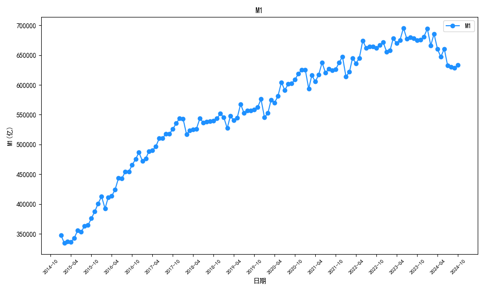

# 货币供应量分析

数据源：AKShare - macro_china_money_supply()

**重要说明**：
从2025年1月起，中国人民银行修订了M1统计口径，M1现包括：
- 流通中货币（M0）
- 单位活期存款
- 个人活期存款
- 非银行支付机构客户备付金

由于历史数据中个人活期存款和企业活期存款不再单独发布，本分析使用M0、M1、M2作为主要指标。
"单位活期存款"为近似值，计算方式为 M1 - M0（在新口径下包含个人活期存款等）。

## M0（流通中货币）

## M1（狭义货币）

## M2（广义货币）

## 单位活期存款（M1-M0）

## 原始数据
| 日期    | M0(亿元)   | M1(亿元)    | M2(亿元)    | M0同比   | M1同比   | M2同比   | 单位活期存款(亿元)   | 单位活期同比   |
|:--------|:-----------|:------------|:------------|:---------|:---------|:---------|:---------------------|:---------------|
| 2025-11 | 137369     | 1.12887e+06 | 3.36989e+06 | 10.60%   | 4.90%    | 8.00%    | 991497               | 4.13%          |
| 2025-10 | 135478     | 1.11996e+06 | 3.35131e+06 | 10.60%   | 6.20%    | 8.20%    | 984485               | 5.58%          |
| 2025-09 | 135813     | 1.13146e+06 | 3.35377e+06 | 11.50%   | 7.20%    | 8.40%    | 995642               | 6.65%          |
| 2025-08 | 133402     | 1.11226e+06 | 3.31983e+06 | 11.70%   | 6.00%    | 8.80%    | 978853               | 5.23%          |
| 2025-07 | 132845     | 1.11059e+06 | 3.29943e+06 | 11.80%   | 5.60%    | 8.80%    | 977742               | 4.80%          |
| 2025-06 | 131827     | 1.13949e+06 | 3.30287e+06 | 12.00%   | 4.60%    | 8.30%    | 1.00767e+06          | 3.73%          |
| 2025-05 | 131259     | 1.08915e+06 | 3.25784e+06 | 12.10%   | 2.30%    | 7.90%    | 957889               | 1.11%          |
| 2025-04 | 131387     | 1.09141e+06 | 3.25174e+06 | 12.00%   | 1.50%    | 8.00%    | 960020               | 0.23%          |
| 2025-03 | 130692     | 1.13486e+06 | 3.26055e+06 | 11.50%   | 1.60%    | 7.00%    | 1.00417e+06          | 0.39%          |
| 2025-02 | 132757     | 1.09437e+06 | 3.20517e+06 | 9.70%    | 0.10%    | 7.00%    | 961613               | -1.08%         |
| 2025-01 | 142254     | 1.12446e+06 | 3.18525e+06 | 17.20%   | 0.40%    | 7.00%    | 982203               | -1.65%         |
| 2024-12 | 128194     | 1.11307e+06 | 3.13532e+06 | 13.00%   | 1.20%    | 7.30%    | 984875               | 73.67%         |
| 2024-11 | 124180     | 1.07638e+06 | 3.11959e+06 | 12.70%   | -0.70%   | 7.10%    | 952199               | 68.33%         |
| 2024-10 | 122447     | 1.05488e+06 | 3.09709e+06 | 12.80%   | -2.30%   | 7.50%    | 932437               | 64.70%         |
| 2024-09 | 121830     | 1.05541e+06 | 3.0948e+06  | 11.50%   | -3.30%   | 6.80%    | 933580               | 64.02%         |
| 2024-08 | 119473     | 1.04968e+06 | 3.05046e+06 | 12.20%   | -3.00%   | 6.30%    | 930211               | 62.32%         |
| 2024-07 | 118840     | 1.0518e+06  | 3.03306e+06 | 12.00%   | -2.60%   | 6.30%    | 932960               | 63.36%         |
| 2024-06 | 117737     | 1.08917e+06 | 3.05016e+06 | 11.70%   | -1.70%   | 6.20%    | 971433               | 64.60%         |
| 2024-05 | 117063     | 1.06439e+06 | 3.01851e+06 | 11.70%   | -0.80%   | 7.00%    | 947328               | 66.05%         |
| 2024-04 | 117311     | 1.07508e+06 | 3.01194e+06 | 10.80%   | 0.60%    | 7.20%    | 957773               | 69.86%         |
| 2024-03 | 117210     | 1.11743e+06 | 3.04795e+06 | 11.00%   | 2.30%    | 8.30%    | 1.00022e+06          | 74.72%         |
| 2024-02 | 121010     | 1.09316e+06 | 2.99557e+06 | 12.50%   | 2.60%    | 8.70%    | 972148               | 76.65%         |
| 2024-01 | 121399     | 1.12012e+06 | 2.97625e+06 | 5.90%    | 3.30%    | 8.70%    | 998721               | 84.74%         |
| 2023-12 | 113445     | 680543      | 2.92271e+06 | 8.30%    | 1.30%    | 9.70%    | 567098               | 0.02%          |
| 2023-11 | 110225     | 675903      | 2.91201e+06 | 10.40%   | 1.30%    | 10.00%   | 565678               | -0.29%         |
| 2023-10 | 108565     | 674696      | 2.88228e+06 | 10.20%   | 1.90%    | 10.30%   | 566131               | 0.43%          |
| 2023-09 | 109253     | 678444      | 2.89666e+06 | 10.70%   | 2.10%    | 10.30%   | 569190               | 0.59%          |
| 2023-08 | 106515     | 679588      | 2.86934e+06 | 9.50%    | 2.20%    | 10.60%   | 573073               | 1.00%          |
| 2023-07 | 106130     | 677219      | 2.85403e+06 | 9.90%    | 2.30%    | 10.70%   | 571089               | 1.02%          |
| 2023-06 | 105419     | 695595      | 2.87302e+06 | 9.80%    | 3.10%    | 11.30%   | 590176               | 2.04%          |
| 2023-05 | 104757     | 675253      | 2.8205e+06  | 9.60%    | 4.70%    | 11.60%   | 570496               | 3.81%          |
| 2023-04 | 105904     | 669762      | 2.80847e+06 | 10.70%   | 5.30%    | 12.40%   | 563857               | 4.32%          |
| 2023-03 | 105591     | 678060      | 2.81457e+06 | 11.00%   | 5.10%    | 12.70%   | 572468               | 4.10%          |
| 2023-02 | 107603     | 657939      | 2.75525e+06 | 10.60%   | 5.80%    | 12.90%   | 550336               | 4.95%          |
| 2023-01 | 114601     | 655214      | 2.73807e+06 | 7.90%    | 6.70%    | 12.60%   | 540613               | 6.49%          |
| 2022-12 | 104706     | 671675      | 2.66432e+06 | 15.30%   | 3.70%    | 11.80%   | 566969               | 1.86%          |
| 2022-11 | 99740.1    | 667043      | 2.64701e+06 | 14.10%   | 4.60%    | 12.40%   | 567302               | 3.14%          |
| 2022-10 | 98416.7    | 662141      | 2.61291e+06 | 14.40%   | 5.80%    | 11.80%   | 563724               | 4.39%          |
| 2022-09 | 98672.1    | 664535      | 2.6266e+06  | 13.60%   | 6.40%    | 12.10%   | 565863               | 5.22%          |
| 2022-08 | 97231      | 664605      | 2.59507e+06 | 14.30%   | 6.10%    | 12.20%   | 567374               | 4.76%          |
| 2022-07 | 96509.2    | 661832      | 2.57808e+06 | 13.90%   | 6.70%    | 12.00%   | 565323               | 5.54%          |
| 2022-06 | 96011.2    | 674375      | 2.58145e+06 | 13.90%   | 5.80%    | 11.40%   | 578364               | 4.56%          |
| 2022-05 | 95546.9    | 645108      | 2.52703e+06 | 13.50%   | 4.60%    | 11.10%   | 549561               | 3.17%          |
| 2022-04 | 95626.5    | 636139      | 2.49971e+06 | 11.50%   | 5.10%    | 10.50%   | 540513               | 4.02%          |
| 2022-03 | 95141.9    | 645064      | 2.49769e+06 | 10.00%   | 4.70%    | 9.70%    | 549922               | 3.84%          |
| 2022-02 | 97227.7    | 621612      | 2.44149e+06 | 5.80%    | 4.70%    | 9.20%    | 524384               | 4.55%          |
| 2022-01 | 106189     | 613859      | 2.43102e+06 | 18.50%   | -1.90%   | 9.80%    | 507670               | -5.27%         |
| 2021-12 | 90825.1    | 647443      | 2.3829e+06  | 7.70%    | 3.50%    | 9.00%    | 556618               | 2.84%          |
| 2021-11 | 87433.4    | 637482      | 2.35601e+06 | 7.20%    | 3.00%    | 8.50%    | 550049               | 2.42%          |
| 2021-10 | 86085.8    | 626082      | 2.33616e+06 | 6.20%    | 2.80%    | 8.70%    | 539996               | 2.24%          |
| 2021-09 | 86867.1    | 624646      | 2.34283e+06 | 5.50%    | 3.70%    | 8.30%    | 537779               | 3.43%          |
| 2021-08 | 85059.2    | 626659      | 2.31227e+06 | 6.30%    | 4.20%    | 8.20%    | 541599               | 3.90%          |
| 2021-07 | 84717.6    | 620367      | 2.30215e+06 | 6.10%    | 4.90%    | 8.30%    | 535649               | 4.76%          |
| 2021-06 | 84347      | 637479      | 2.31779e+06 | 6.20%    | 5.50%    | 8.60%    | 553132               | 5.39%          |
| 2021-05 | 84177.7    | 616828      | 2.27554e+06 | 5.60%    | 6.10%    | 8.30%    | 532651               | 6.23%          |
| 2021-04 | 85803.4    | 605422      | 2.26211e+06 | 5.30%    | 6.20%    | 8.10%    | 519619               | 6.33%          |
| 2021-03 | 86543.6    | 616113      | 2.27649e+06 | 4.20%    | 7.10%    | 9.40%    | 529570               | 7.63%          |
| 2021-02 | 91924.6    | 593487      | 2.23603e+06 | 4.20%    | 7.40%    | 10.10%   | 501563               | 7.98%          |
| 2021-01 | 89625.2    | 625564      | 2.21305e+06 | -3.90%   | 14.70%   | 9.40%    | 535939               | 18.50%         |
| 2020-12 | 84314.5    | 625581      | 2.1868e+06  | 9.20%    | 8.60%    | 10.10%   | 541266               | 8.51%          |
| 2020-11 | 81593.6    | 618632      | 2.172e+06   | 10.30%   | 10.00%   | 10.70%   | 537039               | 9.93%          |
| 2020-10 | 81036.4    | 609182      | 2.14972e+06 | 10.40%   | 9.10%    | 10.50%   | 528146               | 8.95%          |
| 2020-09 | 82370.9    | 602312      | 2.16408e+06 | 11.10%   | 8.10%    | 10.90%   | 519941               | 7.65%          |
| 2020-08 | 80042.7    | 601289      | 2.13684e+06 | 9.40%    | 8.00%    | 10.40%   | 521246               | 7.77%          |
| 2020-07 | 79867.2    | 591193      | 2.12546e+06 | 9.90%    | 6.90%    | 10.70%   | 511325               | 6.45%          |
| 2020-06 | 79459.4    | 604318      | 2.13495e+06 | 9.50%    | 6.50%    | 11.10%   | 524859               | 6.01%          |
| 2020-05 | 79706.8    | 581111      | 2.10018e+06 | 9.50%    | 6.80%    | 11.10%   | 501404               | 6.33%          |
| 2020-04 | 81485.2    | 570150      | 2.09353e+06 | 10.20%   | 5.50%    | 11.10%   | 488665               | 4.72%          |
| 2020-03 | 83022.2    | 575050      | 2.08092e+06 | 10.80%   | 5.00%    | 10.10%   | 492028               | 4.10%          |
| 2020-02 | 88187.1    | 552701      | 2.03083e+06 | 10.90%   | 4.80%    | 8.80%    | 464514               | 3.75%          |
| 2020-01 | 93249.2    | 545532      | 2.02307e+06 | 6.60%    | 0.00%    | 8.40%    | 452283               | -1.28%         |
| 2019-12 | 77189.5    | 576009      | 1.98649e+06 | 5.40%    | 4.40%    | 8.70%    | 498820               | 4.25%          |
| 2019-11 | 73973.8    | 562487      | 1.96143e+06 | 4.80%    | 3.50%    | 8.20%    | 488513               | 3.29%          |
| 2019-10 | 73395.4    | 558144      | 1.9456e+06  | 4.70%    | 3.30%    | 8.40%    | 484749               | 3.13%          |
| 2019-09 | 74129.8    | 557138      | 1.95225e+06 | 4.00%    | 3.40%    | 8.40%    | 483008               | 3.36%          |
| 2019-08 | 73152.6    | 556798      | 1.93549e+06 | 4.80%    | 3.40%    | 8.20%    | 483645               | 3.22%          |
| 2019-07 | 72689.2    | 553043      | 1.91941e+06 | 4.50%    | 3.10%    | 8.10%    | 480354               | 2.84%          |
| 2019-06 | 72581      | 567696      | 1.92136e+06 | 4.30%    | 4.40%    | 8.50%    | 495115               | 4.38%          |
| 2019-05 | 72798.5    | 544356      | 1.89115e+06 | 4.30%    | 3.40%    | 8.50%    | 471557               | 3.30%          |
| 2019-04 | 73965.8    | 540615      | 1.88467e+06 | 3.50%    | 2.90%    | 8.50%    | 466649               | 2.79%          |
| 2019-03 | 74941.6    | 547576      | 1.88941e+06 | 3.10%    | 4.60%    | 8.60%    | 472634               | 4.83%          |
| 2019-02 | 79484.7    | 527190      | 1.86743e+06 | -2.40%   | 1.60%    | 8.00%    | 447706               | 2.78%          |
| 2019-01 | 87470.6    | 545638      | 1.86594e+06 | 17.20%   | 0.40%    | 8.40%    | 458168               | -2.23%         |
| 2018-12 | 73208.4    | 551686      | 1.82674e+06 | 3.60%    | 1.50%    | 8.10%    | 478478               | 1.13%          |
| 2018-11 | 70563.3    | 543499      | 1.81318e+06 | 2.80%    | 1.50%    | 8.00%    | 472935               | 1.28%          |
| 2018-10 | 70106.6    | 540128      | 1.79556e+06 | 2.80%    | 2.70%    | 8.00%    | 470022               | 2.68%          |
| 2018-09 | 71254.3    | 538574      | 1.80167e+06 | 2.20%    | 4.00%    | 8.30%    | 467320               | 4.29%          |
| 2018-08 | 69775.4    | 538325      | 1.78867e+06 | 3.30%    | 3.90%    | 8.20%    | 468549               | 3.99%          |
| 2018-07 | 69530.6    | 536624      | 1.7762e+06  | 3.60%    | 5.10%    | 8.50%    | 467094               | 5.35%          |
| 2018-06 | 69589.3    | 543945      | 1.77018e+06 | 3.90%    | 6.60%    | 8.00%    | 474355               | 7.02%          |
| 2018-05 | 69774.8    | 526277      | 1.74306e+06 | 3.60%    | 6.00%    | 8.30%    | 456502               | 6.40%          |
| 2018-04 | 71476.5    | 525448      | 1.73768e+06 | 4.50%    | 7.20%    | 8.30%    | 453971               | 7.63%          |
| 2018-03 | 72692.6    | 523540      | 1.73986e+06 | 6.00%    | 7.10%    | 8.20%    | 450847               | 7.30%          |
| 2018-02 | 81424.2    | 517036      | 1.72907e+06 | 13.50%   | 8.50%    | 8.80%    | 435612               | 7.61%          |
| 2018-01 | 74636.3    | 543247      | 1.72081e+06 | -13.80%  | 15.00%   | 8.60%    | 468611               | 21.42%         |
| 2017-12 | 70645.6    | 543790      | 1.69024e+06 | 3.40%    | 11.80%   | 8.07%    | 473145               | 13.12%         |
| 2017-11 | 68623.2    | 535565      | 1.67916e+06 | 5.70%    | 12.70%   | 9.11%    | 466942               | 13.75%         |
| 2017-10 | 68230.7    | 525977      | 1.66245e+06 | 6.30%    | 13.00%   | 8.88%    | 457747               | 14.09%         |
| 2017-09 | 69748.5    | 517863      | 1.66367e+06 | 7.20%    | 14.00%   | 8.98%    | 448114               | 15.12%         |
| 2017-08 | 67551      | 518114      | 1.65295e+06 | 6.50%    | 14.00%   | 8.56%    | 450563               | 15.21%         |
| 2017-07 | 67129      | 510485      | 1.63634e+06 | 6.10%    | 15.30%   | 8.89%    | 443356               | 16.78%         |
| 2017-06 | 66977.7    | 510228      | 1.6395e+06  | 6.60%    | 15.00%   | 9.10%    | 443250               | 16.39%         |
| 2017-05 | 67333.2    | 496390      | 1.60974e+06 | 7.30%    | 17.00%   | 9.13%    | 429057               | 18.70%         |
| 2017-04 | 68392.6    | 490180      | 1.60392e+06 | 6.20%    | 18.50%   | 9.84%    | 421788               | 20.82%         |
| 2017-03 | 68605.1    | 488770      | 1.60794e+06 | 6.10%    | 18.80%   | 10.12%   | 420165               | 21.11%         |
| 2017-02 | 71727.7    | 476528      | 1.58986e+06 | 3.30%    | 21.40%   | 10.45%   | 404800               | 25.29%         |
| 2017-01 | 86598.6    | 472526      | 1.58419e+06 | 19.40%   | 14.50%   | 10.70%   | 385928               | 13.46%         |
| 2016-12 | 68303.9    | 486557      | 1.55007e+06 | 8.10%    | 21.40%   | 11.30%   | 418253               | 23.84%         |
| 2016-11 | 64903.5    | 475406      | 1.53043e+06 | 7.60%    | 22.70%   | 11.40%   | 410502               | 25.42%         |
| 2016-10 | 64214.9    | 465447      | 1.51949e+06 | 7.20%    | 23.90%   | 11.60%   | 401232               | 27.01%         |
| 2016-09 | 65068.6    | 454340      | 1.51636e+06 | 6.60%    | 24.70%   | 11.50%   | 389272               | 28.31%         |
| 2016-08 | 63454.7    | 454544      | 1.51098e+06 | 7.40%    | 25.30%   | 11.40%   | 391089               | 28.76%         |
| 2016-07 | 63276      | 442934      | 1.49156e+06 | 7.20%    | 25.40%   | 10.20%   | 379658               | 29.09%         |
| 2016-06 | 62818.9    | 443644      | 1.49049e+06 | 7.20%    | 24.60%   | 11.80%   | 380825               | 28.02%         |
| 2016-05 | 62780.7    | 424251      | 1.4617e+06  | 6.30%    | 23.70%   | 11.80%   | 361470               | 27.27%         |
| 2016-04 | 64403.2    | 413505      | 1.44521e+06 | 6.00%    | 22.90%   | 12.80%   | 349102               | 26.66%         |
| 2016-03 | 64651.2    | 411581      | 1.4462e+06  | 4.40%    | 22.10%   | 13.40%   | 346930               | 26.04%         |
| 2016-02 | 69421.5    | 392505      | 1.42462e+06 | -4.80%   | 17.40%   | 13.30%   | 323083               | 23.53%         |
| 2016-01 | 72526.5    | 412686      | 1.41632e+06 | 15.10%   | 18.60%   | 14.00%   | 340159               | 19.33%         |
| 2015-12 | 63216.6    | 400953      | 1.39228e+06 | 4.90%    | 15.20%   | 13.30%   | 337737               | 17.35%         |
| 2015-11 | 60328.2    | 387618      | 1.37396e+06 | 3.20%    | 15.70%   | 13.70%   | 327290               | 18.29%         |
| 2015-10 | 59900.5    | 375806      | 1.36102e+06 | 3.80%    | 14.00%   | 13.50%   | 315906               | 16.17%         |
| 2015-09 | 61023      | 364417      | 1.35982e+06 | 3.70%    | 11.40%   | 13.10%   | 303394               | 13.05%         |
| 2015-08 | 59061.8    | 362794      | 1.35691e+06 | 1.80%    | 9.30%    | 13.30%   | 303732               | 10.84%         |
| 2015-07 | 59010.7    | 353122      | 1.35321e+06 | 2.90%    | 6.60%    | 13.30%   | 294111               | 7.34%          |
| 2015-06 | 58604.3    | 356083      | 1.33338e+06 | 2.90%    | 4.30%    | 11.80%   | 297479               | 4.55%          |
| 2015-05 | 59076      | 343086      | 1.30736e+06 | 1.80%    | 4.70%    | 10.80%   | 284010               | 5.27%          |
| 2015-04 | 60772.5    | 336388      | 1.28078e+06 | 3.70%    | 3.70%    | 10.10%   | 275616               | 3.67%          |
| 2015-03 | 61949.8    | 337211      | 1.27533e+06 | 6.20%    | 2.90%    | 11.60%   | 275261               | 2.19%          |
| 2015-02 | 72896.2    | 334439      | 1.25738e+06 | 17.00%   | 5.60%    | 12.50%   | 261543               | 2.85%          |
| 2015-01 | 63040.5    | 348110      | 1.24271e+06 | -17.60%  | 10.60%   | 10.80%   | 285069               | 19.57%         |
| 2014-12 | 60259.5    | 348056      | 1.22837e+06 | 2.90%    | 3.20%    | 12.20%   | 287797               | 3.26%          |
| 2014-11 | 58438.5    | 335114      | 1.20861e+06 | 3.50%    | 3.20%    | 12.30%   | 276676               | 3.09%          |
| 2014-10 | 57691.6    | 329618      | 1.19924e+06 | 3.80%    | 3.20%    | 12.60%   | 271926               | 3.04%          |
| 2014-09 | 58845      | 327220      | 1.20205e+06 | 4.20%    | 4.80%    | 12.90%   | 268375               | 4.90%          |
| 2014-08 | 57997.6    | 332023      | 1.1975e+06  | 5.60%    | 5.70%    | 12.80%   | 274026               | 5.74%          |
| 2014-07 | 57346.5    | 331347      | 1.19425e+06 | 5.40%    | 6.70%    | 13.50%   | 274001               | 6.95%          |
| 2014-06 | 56951.1    | 341487      | 1.20959e+06 | 5.30%    | 8.90%    | 14.70%   | 284536               | 9.68%          |
| 2014-05 | 58051.1    | 327840      | 1.18229e+06 | 6.70%    | 5.70%    | 13.40%   | 269788               | 5.48%          |
| 2014-04 | 58615.5    | 324483      | 1.16881e+06 | 5.40%    | 5.50%    | 13.20%   | 265867               | 5.49%          |
| 2014-03 | 58329.3    | 327684      | 1.16069e+06 | 5.20%    | 5.40%    | 12.10%   | 269354               | 5.45%          |
| 2014-02 | 62320.9    | 316625      | 1.13176e+06 | 3.30%    | 6.90%    | 13.30%   | 254304               | 7.85%          |
| 2014-01 | 76488.6    | 314901      | 1.12352e+06 | 22.50%   | 1.20%    | 13.20%   | 238412               | -4.17%         |
| 2013-12 | 58574.4    | 337291      | 1.10652e+06 | 7.10%    | 9.30%    | 13.60%   | 278717               | 9.73%          |
| 2013-11 | 56441.3    | 324822      | 1.07926e+06 | 7.70%    | 9.40%    | 14.20%   | 268381               | 9.77%          |
| 2013-10 | 55595.7    | 319509      | 1.07024e+06 | 8.00%    | 8.90%    | 14.30%   | 263914               | 9.13%          |
| 2013-09 | 56492.5    | 312330      | 1.07738e+06 | 5.70%    | 8.90%    | 14.20%   | 255838               | 9.63%          |
| 2013-08 | 54925.3    | 314086      | 1.06126e+06 | 9.30%    | 9.90%    | 14.70%   | 259161               | 10.04%         |
| 2013-07 | 54412.8    | 310596      | 1.05221e+06 | 9.50%    | 9.70%    | 14.50%   | 256184               | 9.77%          |
| 2013-06 | 54063.9    | 313500      | 1.0544e+06  | 9.90%    | 9.10%    | 14.00%   | 259436               | 8.90%          |
| 2013-05 | 54431.4    | 310204      | 1.04217e+06 | 10.80%   | 11.30%   | 15.80%   | 255773               | 11.39%         |
| 2013-04 | 55607.2    | 307648      | 1.03255e+06 | 10.80%   | 11.90%   | 16.10%   | 252041               | 12.13%         |
| 2013-03 | 55460.5    | 310898      | 1.03586e+06 | 12.40%   | 11.90%   | 15.70%   | 255438               | 11.84%         |
| 2013-02 | 60313.7    | 296103      | 998601      | 17.20%   | 9.50%    | 15.20%   | 235790               | 7.73%          |
| 2013-01 | 62449.6    | 311229      | 992129      | 4.40%    | 15.30%   | 15.90%   | 248779               | 18.36%         |
| 2012-12 | 54659.8    | 308664      | 974149      | 7.70%    | 6.50%    | 13.80%   | 254004               | 6.23%          |
| 2012-11 | 52392.1    | 296883      | 944832      | 10.70%   | 5.50%    | 13.90%   | 244491               | 4.44%          |
| 2012-10 | 51467.7    | 293310      | 936404      | 10.50%   | 6.10%    | 14.10%   | 241842               | 5.16%          |
| 2012-09 | 53433.5    | 286788      | 943689      | 13.30%   | 7.30%    | 14.80%   | 233355               | 6.05%          |
| 2012-08 | 50235.1    | 285739      | 924895      | 9.70%    | 4.50%    | 13.50%   | 235504               | 3.46%          |
| 2012-07 | 49705.8    | 283091      | 919072      | 10.00%   | 4.60%    | 13.90%   | 233385               | 3.56%          |
| 2012-06 | 49284.6    | 287526      | 924991      | 10.80%   | 4.70%    | 13.60%   | 238242               | 3.50%          |
| 2012-05 | 49039.7    | 278656      | 900049      | 10.00%   | 3.50%    | 13.20%   | 229617               | 2.19%          |
| 2012-04 | 50199.3    | 274984      | 889604      | 10.40%   | 3.10%    | 12.80%   | 224784               | 1.58%          |
| 2012-03 | 49595.7    | 277998      | 895566      | 10.60%   | 4.40%    | 13.40%   | 228402               | 3.16%          |
| 2012-02 | 51448.8    | 270312      | 867171      | 8.80%    | 4.30%    | 13.00%   | 218863               | 3.27%          |
| 2012-01 | 59820.7    | 270010      | 855899      | 3.00%    | 3.10%    | 12.40%   | 210190               | 3.19%          |
| 2011-12 | 50748.5    | 289848      | 851591      | 13.80%   | 7.90%    | 13.60%   | 239099               | 7.71%          |
| 2011-11 | 47317.3    | 281416      | 825494      | 12.00%   | 7.80%    | 12.70%   | 234099               | 7.80%          |
| 2011-10 | 46579.4    | 276553      | 816829      | 11.90%   | 8.40%    | 12.90%   | 229973               | 8.65%          |
| 2011-09 | 47145.3    | 267193      | 787406      | 12.68%   | 8.85%    | 13.04%   | 220048               | 8.95%          |
| 2011-08 | 45775.3    | 273394      | 780852      | 14.70%   | 11.20%   | 13.50%   | 227618               | 11.35%         |
| 2011-07 | 45183.1    | 270546      | 772924      | 14.30%   | 11.60%   | 14.70%   | 225363               | 12.05%         |
| 2011-06 | 44477.8    | 274663      | 780821      | 14.40%   | 13.10%   | 15.90%   | 230185               | 14.14%         |
| 2011-05 | 44602.8    | 269290      | 763409      | 15.40%   | 12.70%   | 15.10%   | 224687               | 13.57%         |
| 2011-04 | 45489      | 266767      | 757385      | 14.70%   | 12.90%   | 15.30%   | 221278               | 13.91%         |
| 2011-03 | 44845.2    | 266255      | 758131      | 14.80%   | 15.00%   | 16.60%   | 221410               | 16.34%         |
| 2011-02 | 47270.2    | 259200      | 736131      | 10.30%   | 14.50%   | 15.70%   | 211930               | 16.82%         |
| 2011-01 | 58063.9    | 261765      | 733885      | 42.50%   | 13.60%   | 17.20%   | 203701               | 7.88%          |
| 2010-12 | 44628.2    | 266622      | 725852      | 16.70%   | 21.20%   | 19.70%   | 221993               | 21.18%         |
| 2010-11 | 42252.2    | 259420      | 710339      | 16.30%   | 22.10%   | 19.50%   | 217168               | 23.29%         |
| 2010-10 | 41646.2    | 253313      | 699777      | 16.60%   | 22.10%   | 19.30%   | 211667               | 23.19%         |
| 2010-09 | 41854.4    | 243822      | 696472      | 13.80%   | 20.90%   | 19.00%   | 201967               | 22.46%         |
| 2010-08 | 39922.8    | 244341      | 687507      | 16.00%   | 21.90%   | 19.20%   | 204418               | 23.15%         |
| 2010-07 | 39543.2    | 240664      | 674051      | 15.50%   | 22.90%   | 17.60%   | 201121               | 24.42%         |
| 2010-06 | 38904.8    | 240580      | 673922      | 15.70%   | 24.60%   | 18.50%   | 201675               | 26.44%         |
| 2010-05 | 38653      | 236498      | 663351      | 15.20%   | 29.90%   | 21.00%   | 197845               | 33.26%         |
| 2010-04 | 39657.5    | 233910      | 656561      | 15.76%   | 31.25%   | 21.48%   | 194252               | 34.94%         |
| 2010-03 | 39080.6    | 229398      | 649947      | 15.81%   | 29.94%   | 22.50%   | 190317               | 33.28%         |
| 2010-02 | 42865.8    | 224287      | 636072      | 21.98%   | 34.99%   | 25.52%   | 181421               | 38.48%         |
| 2010-01 | 40758.6    | 229589      | 625609      | -0.79%   | 38.96%   | 25.98%   | 188830               | 52.12%         |
| 2009-12 | 38247      | 221446      | 610225      | 11.77%   | 32.35%   | 27.68%   | 183199               | 38.79%         |
| 2009-11 | 36343.9    | 212493      | 594605      | 14.99%   | 34.63%   | 29.74%   | 176149               | 39.56%         |
| 2009-10 | 35730.2    | 207546      | 586643      | 14.09%   | 32.03%   | 29.42%   | 171816               | 36.50%         |
| 2009-09 | 36787.9    | 201708      | 585405      | 15.96%   | 29.51%   | 29.31%   | 164920               | 32.97%         |
| 2009-08 | 34406.6    | 200395      | 576699      | 11.52%   | 27.72%   | 28.53%   | 165988               | 31.70%         |
| 2009-07 | 34239.3    | 195889      | 573103      | 11.59%   | 26.37%   | 28.42%   | 161650               | 30.04%         |
| 2009-06 | 33641      | 193138      | 568916      | 11.46%   | 24.79%   | 28.46%   | 159497               | 27.97%         |
| 2009-05 | 33559.5    | 182026      | 548264      | 11.24%   | 18.69%   | 25.74%   | 148466               | 20.53%         |
| 2009-04 | 34257.3    | 178214      | 540481      | 11.26%   | 17.48%   | 25.95%   | 143956               | 19.07%         |
| 2009-03 | 33746.4    | 176541      | 530627      | 10.88%   | 17.04%   | 25.51%   | 142795               | 18.57%         |
| 2009-02 | 35141.6    | 166150      | 506708      | 8.28%    | 10.87%   | 20.48%   | 131008               | 11.28%         |
| 2009-01 | 41082.4    | 165214      | 496135      | 12.02%   | 6.68%    | 18.79%   | 124132               | 5.02%          |
| 2008-12 | 34219      | 166217      | 475167      | 12.65%   | 9.06%    | 17.82%   | 131998               | nan%           |
| 2008-11 | 31607.4    | 157827      | 458645      | 9.04%    | 6.80%    | 14.80%   | 126219               | nan%           |
| 2008-10 | 31317.8    | 157194      | 453133      | 10.59%   | 8.85%    | 15.02%   | 125877               | nan%           |
| 2008-09 | 31724.9    | 155749      | 452899      | 9.28%    | 9.43%    | 15.29%   | 124024               | nan%           |
| 2008-08 | 30851.6    | 156890      | 448847      | 10.89%   | 11.48%   | 16.00%   | 126038               | nan%           |
| 2008-07 | 30687.2    | 154992      | 446362      | 12.30%   | 13.96%   | 16.35%   | 124305               | nan%           |
| 2008-06 | 30181.3    | 154820      | 443141      | 12.28%   | 14.19%   | 17.37%   | 124639               | nan%           |
| 2008-05 | 30169.3    | 153345      | 436222      | 12.88%   | 17.93%   | 18.07%   | 123175               | nan%           |
| 2008-04 | 30789.6    | 151695      | 429314      | 10.70%   | 19.05%   | 16.94%   | 120905               | nan%           |
| 2008-03 | 30433.1    | 150867      | 423055      | 11.12%   | 17.97%   | 16.19%   | 120434               | nan%           |
| 2008-02 | 32454.5    | 150178      | 421038      | 5.96%    | 18.95%   | 17.39%   | 117723               | nan%           |
| 2008-01 | 36673.2    | 154873      | 417846      | 31.21%   | 20.54%   | 18.88%   | 118199               | nan%           |