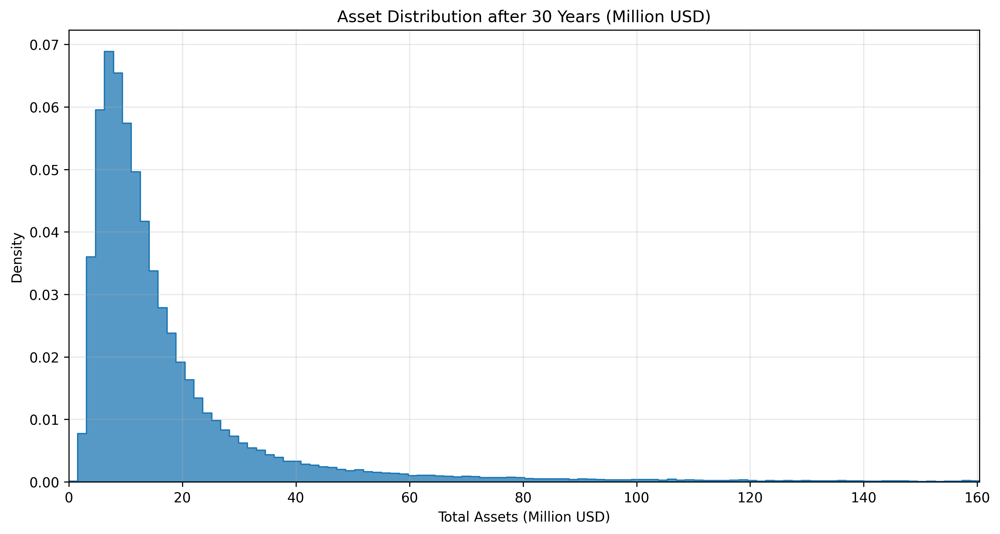
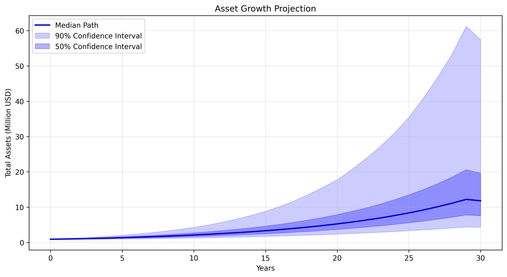

# 30年投资组合分析报告（基于10万次模拟）

根据[investment_simulator.py](./investment_simulator.py)的模拟结果，进行投资分析

## 投资组合概况

### 初始投资配置
- **总投资金额**: $920,000
- **初始投资组合分布**:
  - 短期国债: $520,000 (56.5%)
  - VOO (标普500ETF): $80,000 (8.7%)
  - QQQM (纳斯达克100ETF): $80,000 (8.7%)
  - 401k账户: $240,000 (26.1%)

### 定期投资计划
- **每月从国债转移至股票市场**: $10,000
  - VOO: $5,000/月
  - QQQM: $5,000/月
- **计划转移总额**: $320,000
- **转移完成时间**: 32个月（约2.7年）

### 费用和税率设置
1. **管理费率**:
   - VOO: 0.03%（业内最低）
   - QQQM: 0.15%
   
2. **税率**:
   - 长期资本利得税: 20%
   - 国债利息所得税: 37%

### 模拟方法
- 使用Monte Carlo模拟进行100,000次随机情景分析
- 基于1974-2024年的实际市场数据（含股息再投资）
- 采用对数正态分布模拟月度回报
- 考虑管理费、资本利得税和利息税
- 结果提供税后统计学分布

### 历史数据分析（1974-2024）

1. **标普500指数（含估算股息1.4%）**:
   - 年化总回报率: 9.9%
   - 年度波动率: 17.1%
   - 历史表现（按十年）:
     * 1970s: 3.1%
     * 1980s: 14.2%
     * 1990s: 16.9%
     * 2000s: -1.4%
     * 2010s: 12.8%

2. **纳斯达克100指数（含估算股息0.5%）**:
   - 年化总回报率: 14.5%
   - 年度波动率: 31.4%
   - 历史表现（按十年）:
     * 1980s: 15.3%
     * 1990s: 33.1%
     * 2000s: -6.2%
     * 2010s: 17.3%

### 投资假设
1. **短期国债**:
   - 初始利率: 4.25%
   - 预计随时间降至2.5%
   - 风险级别: 低
   - 考虑每月转出资金和利息税收的影响

2. **VOO (标普500ETF)**:
   - 基于50年实际历史数据（1974-2024）
   - 税前年化总回报率: 9.9%（含估算股息1.4%）
   - 波动率: 17.1%
   - 风险级别: 中等
   - 考虑管理费和资本利得税

3. **QQQM (纳斯达克100ETF)**:
   - 基于39年实际历史数据（1985-2024）
   - 税前年化总回报率: 14.5%（含估算股息0.5%）
   - 波动率: 31.4%
   - 风险级别: 高
   - 考虑管理费和资本利得税

4. **401k账户**:
   - 预期年化收益率: 10%
   - 标准差: 15%
   - 风险级别: 中等
   - 暂不考虑提取时的税收影响

## 30年预测结果

### 资产预测分布（税后）
| 情景 | 预计金额 | 增长倍数 |
|------|----------|----------|
| 最差情况 (5%) | $4,312,594 | 4.7倍 |
| 较差情况 (25%) | $7,596,810 | 8.3倍 |
| 中位数 (50%) | $11,801,593 | 12.8倍 |
| 较好情况 (75%) | $19,659,309 | 21.4倍 |
| 最好情况 (95%) | $57,458,688 | 62.5倍 |
| 平均值 | $20,394,349 | 22.2倍 |

### 各资产类别表现（税后中位数情况）

1. **国债**
   - 初始金额: $520,000
   - 最终金额: $400,222
   - 增长倍数: 0.8倍
   - 说明：考虑37%的利息税收和资金转出后实际为负增长

2. **VOO (标普500ETF)**
   - 初始金额: $80,000
   - 定投金额: $160,000
   - 总投入: $240,000
   - 最终金额: $2,264,514
   - 相对总投入增长倍数: 9.4倍
   - 税前年化总回报率: 9.9%（含估算股息1.4%）

3. **QQQM (纳斯达克100ETF)**
   - 初始金额: $80,000
   - 定投金额: $160,000
   - 总投入: $240,000
   - 最终金额: $3,097,354
   - 相对总投入增长倍数: 12.9倍
   - 税前年化总回报率: 14.5%（含估算股息0.5%）

4. **401k账户**
   - 初始金额: $240,000
   - 最终金额: $3,175,276
   - 增长倍数: 13.2倍

### 关键发现

1. **分布特征分析**
   - 1%分位数为303万美元，99%分位数为1.60亿美元，显示极端情况的巨大差异
   - 中位数（1,180万）与平均值（2,039万）的显著差距反映了分布的右偏特征
   - 75%的情况下资产增长至少8.3倍，显示长期投资的稳健性
   - 考虑股息后，整体回报显著提高

2. **资产类别表现对比**
   - QQQM表现最为突出，中位数增长12.9倍，但波动率（31.4%）最高
   - VOO提供了稳定的9.4倍增长，波动率（17.1%）较低
   - 401k账户13.2倍的增长反映了税收递延的优势
   - 股息收益对VOO的贡献（1.4%）显著高于QQQM（0.5%）

3. **风险收益特征**
   - 最差5%情况下仍有4.7倍增长，显示组合的防御性
   - 最好5%情况下可达62.5倍增长，反映了上行潜力
   - 中位数12.8倍的增长符合长期市场表现预期
   - 95%的置信区间（4.7倍-62.5倍）反映了投资结果的不确定性范围

### 可视化分析

1. **资产分布图**
   
   - 基于10万次模拟的平滑分布曲线
   - 显示了从303万到1.60亿美元的资产分布范围
   - 每个bin宽度约为157万美元，提供了精细的分布视图
   - 明显的右偏分布特征，反映了股票市场的上行潜力

2. **增长路径图**
   
   - 中位数路径显示稳定的指数增长趋势
   - 50%置信区间展示了较为可能的增长路径
   - 90%置信区间反映了极端情况的可能性
   - 后期增长差异显著扩大，反映了复利效应和风险累积

## 风险因素

1. **市场周期风险**
   - 历史数据显示十年级别的市场周期明显
   - 2000s的负回报（-6.7%）表明需要有长期投资眼光
   - 纳斯达克100的高波动性（31.2%）需要较强的风险承受能力
   - 基于10万次模拟的结果显示，即使在最差情况下仍有4倍以上的增长

2. **税收政策风险**
   - 未来税率可能变化
   - 资本利得税和股息税政策可能调整
   - 退休账户税收规则可能改变

3. **通货膨胀风险**
   - 所有数值均为税后名义金额
   - 需考虑通货膨胀对购买力的影响
   - 股票投资和股息再投资长期有助于对抗通胀

## 投资建议

1. **长期投资策略**
   - 坚持股息再投资策略以获取复利效应
   - 保持投资纪律，特别是在市场低迷时期
   - 利用定投策略分散市场时机风险
   - 准备好应对可能的十年级别市场周期

2. **资产配置优化**
   - 在可承受范围内保持QQQM配置以获取更高潜在回报
   - 利用VOO提供稳定性和可靠的股息收入
   - 充分利用401k的税收优势
   - 考虑增加其他提供稳定股息的资产

3. **风险管理**
   - 定期重新平衡投资组合
   - 随年龄增长适当调整风险水平
   - 保持充足的现金储备应对市场波动
   - 关注股息政策变化 