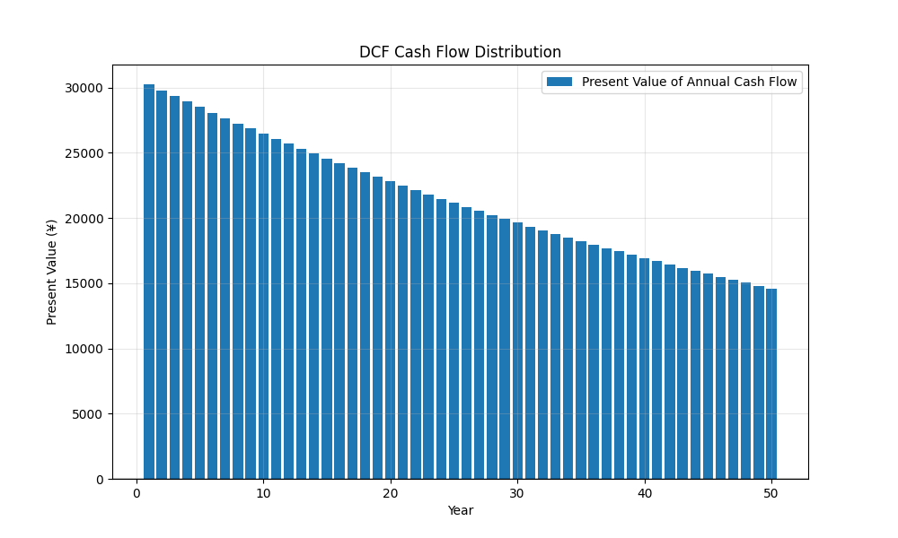

# 房地产DCF估值分析报告
*生成时间: 2025-01-10 23:24:43*

## 基本参数
### 收入与支出
- 初始年租金收入: ¥66,000.00
- 初始年运营支出: ¥500.00

### 房产税信息
- 房产评估价值: ¥1,320,000.00
- 房产税率: 0.0%
- 年度房产税: ¥0.00

### 其他参数
- 增长率: 0.0%
- 贴现率: 3.5%
- 预测年数: 50年
- 最终资本化率: 5.0%

## 估值结果
- 现金流现值总和: ¥1,536,342.97
- 终值现值: ¥234,559.92
- **总价值: ¥1,770,902.89**

## 现金流分析
### 年度现金流现值表
| 年份 | 现金流现值 |
|------|------------|
| 1 | ¥63,285.02 |
| 2 | ¥61,144.95 |
| 3 | ¥59,077.25 |
| 4 | ¥57,079.47 |
| 5 | ¥55,149.24 |
| 6 | ¥53,284.29 |
| 7 | ¥51,482.41 |
| 8 | ¥49,741.46 |
| 9 | ¥48,059.38 |
| 10 | ¥46,434.18 |
| 11 | ¥44,863.94 |
| 12 | ¥43,346.81 |
| 13 | ¥41,880.97 |
| 14 | ¥40,464.71 |
| 15 | ¥39,096.34 |
| 16 | ¥37,774.24 |
| 17 | ¥36,496.85 |
| 18 | ¥35,262.65 |
| 19 | ¥34,070.20 |
| 20 | ¥32,918.07 |
| 21 | ¥31,804.89 |
| 22 | ¥30,729.37 |
| 23 | ¥29,690.21 |
| 24 | ¥28,686.19 |
| 25 | ¥27,716.13 |
| 26 | ¥26,778.87 |
| 27 | ¥25,873.30 |
| 28 | ¥24,998.36 |
| 29 | ¥24,153.00 |
| 30 | ¥23,336.24 |
| 31 | ¥22,547.09 |
| 32 | ¥21,784.63 |
| 33 | ¥21,047.95 |
| 34 | ¥20,336.18 |
| 35 | ¥19,648.48 |
| 36 | ¥18,984.04 |
| 37 | ¥18,342.07 |
| 38 | ¥17,721.81 |
| 39 | ¥17,122.52 |
| 40 | ¥16,543.50 |
| 41 | ¥15,984.05 |
| 42 | ¥15,443.53 |
| 43 | ¥14,921.29 |
| 44 | ¥14,416.70 |
| 45 | ¥13,929.18 |
| 46 | ¥13,458.15 |
| 47 | ¥13,003.04 |
| 48 | ¥12,563.32 |
| 49 | ¥12,138.48 |
| 50 | ¥11,728.00 |


### 现金流分布图


## DCF计算方法说明
### 1. 基本公式
房产总价值 = 预测期现金流现值之和 + 终值的现值

### 2. 详细计算步骤
1. **年度净现金流(NCF)**
   ```
   年度房产税 = 房产评估价值 × 房产税率
   NCF = 租金收入 - 运营支出 - 年度房产税
   每年NCF = NCF × (1 + 增长率)^年数
   注：房产评估价值也会随增长率增长
   ```

2. **现金流现值(PV)**
   ```
   现金流现值 = NCF ÷ (1 + 贴现率)^年数
   ```

3. **终值(TV)**
   ```
   最终年净现金流 = 初始NCF × (1 + 增长率)^预测年数
   终值 = 最终年净现金流 × (1 + 增长率) ÷ 最终资本化率
   终值现值 = 终值 ÷ (1 + 贴现率)^预测年数
   ```

4. **总价值**
   ```
   总价值 = Σ(NCFt ÷ (1 + r)^t) + TV ÷ (1 + r)^n
   
   其中：
   NCFt = t年的净现金流（已扣除房产税）
   r = 贴现率
   t = 年数
   TV = 终值
   n = 预测期总年数
   ```

## 分析说明
1. 本估值基于DCF（贴现现金流）方法
2. 考虑了租金收入的年度增长
3. 包含了运营支出和房产税的影响
4. 房产评估价值会随年度增长率相应增长
5. 使用终值法计算了预测期后的价值
6. 所有未来现金流都已按照贴现率折现到现值

## 风险提示
- 本估值仅供参考，实际价值可能受市场条件影响而变化
- 预测基于当前参数设定，未来实际情况可能发生变化
- 房产税政策可能发生变化，影响实际税负
- 房产评估价值的变动可能影响房产税金额
- 建议定期更新估值参数以保持评估的准确性 