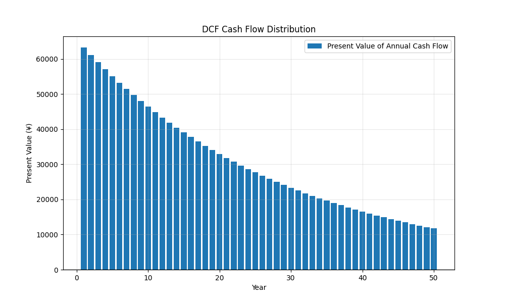

# 房地产DCF估值分析报告
*生成时间: 2025-01-08 23:41:02*

## 基本参数
### 收入与支出
- 初始年租金收入: ¥31,200.00
- 初始年运营支出: ¥500.00

### 房产税信息
- 房产评估价值: ¥624,000.00
- 房产税率: 0.0%
- 年度房产税: ¥0.00

### 其他参数
- 增长率: 0.0%
- 贴现率: 1.5%
- 预测年数: 50年
- 最终资本化率: 5.0%

## 估值结果
- 现金流现值总和: ¥1,074,490.42
- 终值现值: ¥291,652.87
- **总价值: ¥1,366,143.30**

## 现金流分析
### 年度现金流现值表
| 年份 | 现金流现值 |
|------|------------|
| 1 | ¥30,246.31 |
| 2 | ¥29,799.32 |
| 3 | ¥29,358.93 |
| 4 | ¥28,925.06 |
| 5 | ¥28,497.59 |
| 6 | ¥28,076.45 |
| 7 | ¥27,661.52 |
| 8 | ¥27,252.73 |
| 9 | ¥26,849.98 |
| 10 | ¥26,453.18 |
| 11 | ¥26,062.25 |
| 12 | ¥25,677.09 |
| 13 | ¥25,297.63 |
| 14 | ¥24,923.77 |
| 15 | ¥24,555.44 |
| 16 | ¥24,192.55 |
| 17 | ¥23,835.03 |
| 18 | ¥23,482.79 |
| 19 | ¥23,135.75 |
| 20 | ¥22,793.84 |
| 21 | ¥22,456.99 |
| 22 | ¥22,125.11 |
| 23 | ¥21,798.14 |
| 24 | ¥21,476.00 |
| 25 | ¥21,158.62 |
| 26 | ¥20,845.93 |
| 27 | ¥20,537.86 |
| 28 | ¥20,234.35 |
| 29 | ¥19,935.32 |
| 30 | ¥19,640.71 |
| 31 | ¥19,350.45 |
| 32 | ¥19,064.48 |
| 33 | ¥18,782.74 |
| 34 | ¥18,505.16 |
| 35 | ¥18,231.69 |
| 36 | ¥17,962.25 |
| 37 | ¥17,696.80 |
| 38 | ¥17,435.27 |
| 39 | ¥17,177.61 |
| 40 | ¥16,923.75 |
| 41 | ¥16,673.65 |
| 42 | ¥16,427.24 |
| 43 | ¥16,184.47 |
| 44 | ¥15,945.29 |
| 45 | ¥15,709.65 |
| 46 | ¥15,477.49 |
| 47 | ¥15,248.76 |
| 48 | ¥15,023.40 |
| 49 | ¥14,801.38 |
| 50 | ¥14,582.64 |


### 现金流分布图


## DCF计算方法说明
### 1. 基本公式
房产总价值 = 预测期现金流现值之和 + 终值的现值

### 2. 详细计算步骤
1. **年度净现金流(NCF)**
   ```
   年度房产税 = 房产评估价值 × 房产税率
   NCF = 租金收入 - 运营支出 - 年度房产税
   每年NCF = NCF × (1 + 增长率)^年数
   注：房产评估价值也会随增长率增长
   ```

2. **现金流现值(PV)**
   ```
   现金流现值 = NCF ÷ (1 + 贴现率)^年数
   ```

3. **终值(TV)**
   ```
   最终年净现金流 = 初始NCF × (1 + 增长率)^预测年数
   终值 = 最终年净现金流 × (1 + 增长率) ÷ 最终资本化率
   终值现值 = 终值 ÷ (1 + 贴现率)^预测年数
   ```

4. **总价值**
   ```
   总价值 = Σ(NCFt ÷ (1 + r)^t) + TV ÷ (1 + r)^n
   
   其中：
   NCFt = t年的净现金流（已扣除房产税）
   r = 贴现率
   t = 年数
   TV = 终值
   n = 预测期总年数
   ```

## 分析说明
1. 本估值基于DCF（贴现现金流）方法
2. 考虑了租金收入的年度增长
3. 包含了运营支出和房产税的影响
4. 房产评估价值会随年度增长率相应增长
5. 使用终值法计算了预测期后的价值
6. 所有未来现金流都已按照贴现率折现到现值

## 风险提示
- 本估值仅供参考，实际价值可能受市场条件影响而变化
- 预测基于当前参数设定，未来实际情况可能发生变化
- 房产税政策可能发生变化，影响实际税负
- 房产评估价值的变动可能影响房产税金额
- 建议定期更新估值参数以保持评估的准确性 