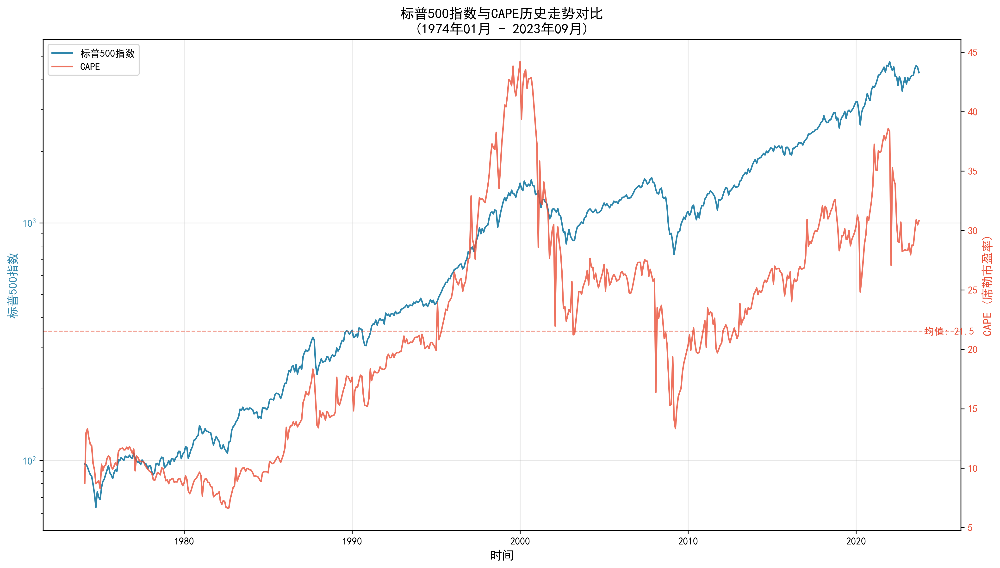

# 标普500 CAPE与未来收益率分析报告

## 数据范围概览

### 各期数据统计
1. **1年期**：1974年01月 至 2023年09月（548个数据点）
2. **3年期**：1974年01月 至 2022年12月（539个数据点）
3. **5年期**：1974年01月 至 2020年12月（517个数据点）
4. **10年期**：1974年01月 至 2015年12月（462个数据点）
5. **20年期**：1974年01月 至 2005年12月（352个数据点）
6. **30年期**：1974年01月 至 1995年12月（242个数据点）

## 当前市场估值

- 当前CAPE：37.0
- CAPE百分位：94.2%
- 历史CAPE区间：6.6 - 44.2
- CAPE均值：21.5
- CAPE中位数：21.7

## 各期限CAPE与收益率相关性分析

### 1年期（1974年01月 - 2023年09月）
- 皮尔逊相关系数：-0.15
- 斯皮尔曼相关系数：-0.11
- 线性回归方程：y = -0.26x + 15.54
- R²值：0.02
- 预期收益率：5.9%

### 3年期（1974年01月 - 2022年12月）
- 皮尔逊相关系数：-0.29
- 斯皮尔曼相关系数：-0.19
- 线性回归方程：y = -0.28x + 15.00
- R²值：0.08
- 预期收益率：4.7%

### 5年期（1974年01月 - 2020年12月）
- 皮尔逊相关系数：-0.42
- 斯皮尔曼相关系数：-0.35
- 线性回归方程：y = -0.32x + 15.69
- R²值：0.18
- 预期收益率：3.8%

### 10年期（1974年01月 - 2015年12月）
- 皮尔逊相关系数：-0.76
- 斯皮尔曼相关系数：-0.66
- 线性回归方程：y = -0.38x + 16.30
- R²值：0.58
- 预期收益率：2.3%

### 20年期（1974年01月 - 2005年12月）
- 皮尔逊相关系数：-0.81
- 斯皮尔曼相关系数：-0.86
- 线性回归方程：y = -0.22x + 12.36
- R²值：0.65
- 预期收益率：4.4%

### 30年期（1974年01月 - 1995年12月）
- 皮尔逊相关系数：-0.27
- 斯皮尔曼相关系数：-0.20
- 线性回归方程：y = -0.04x + 8.77
- R²值：0.07
- 预期收益率：7.4%

## CAPE分位与收益率分析

### 低CAPE时期（25%分位以下）vs 高CAPE时期（75%分位以上）的平均收益率

#### 10年期
- 低CAPE时期平均收益率：10.7%
- 高CAPE时期平均收益率：0.9%
- 收益率差异：9.7%

#### 20年期
- 低CAPE时期平均收益率：11.0%
- 高CAPE时期平均收益率：5.2%
- 收益率差异：5.8%

#### 30年期
- 低CAPE时期平均收益率：8.5%
- 高CAPE时期平均收益率：nan%
- 收益率差异：nan%

## 结论

1. CAPE与未来收益率的关系在不同时间跨度上表现不同：
   - 短期（1-3年）：相关性较弱，预测能力有限
   - 中期（5-10年）：显示出较强的负相关关系
   - 长期（20-30年）：关系趋于稳定
2. 斯皮尔曼相关系数与皮尔逊相关系数的差异反映了关系的非线性特征
3. LOWESS平滑曲线显示了CAPE与收益率之间的局部趋势
4. 当前CAPE处于历史较高水平，预示着未来收益率可能低于历史平均水平
5. 低CAPE时期的投资回报普遍优于高CAPE时期，这种差异在各个时间跨度上都很明显

## 数据可视化

### 标普500指数与CAPE历史走势对比

### CAPE与未来1年收益率关系

### CAPE与未来3年收益率关系

### CAPE与未来5年收益率关系

### CAPE与未来10年收益率关系

### CAPE与未来20年收益率关系

### CAPE与未来30年收益率关系

## 数据来源
- 标普500数据：Yahoo Finance
- CAPE数据：Robert Shiller数据库
- 数据频率：月度数据
- 收益率计算：使用几何平均年化收益率 