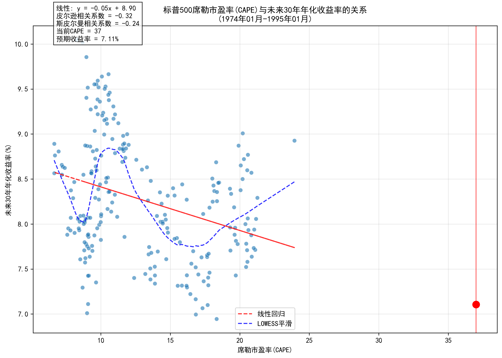

# 标普500 CAPE与未来收益率分析报告

## 数据范围概览

### 各期数据统计
1. **1年期**：1974年01月 至 2023年09月（548个数据点）
2. **3年期**：1974年01月 至 2022年01月（529个数据点）
3. **5年期**：1974年01月 至 2020年01月（507个数据点）
4. **10年期**：1974年01月 至 2015年01月（452个数据点）
5. **20年期**：1974年01月 至 2005年01月（342个数据点）
6. **30年期**：1974年01月 至 1995年01月（232个数据点）

## 当前市场估值

- 当前CAPE：37.0
- CAPE百分位：94.2%
- 历史CAPE区间：6.6 - 44.2
- CAPE均值：21.5
- CAPE中位数：21.7

## 各期限CAPE与收益率相关性分析

### 1年期（1974年01月 - 2023年09月）
- 相关系数：-0.15
- 回归方程：y = -0.26x + 15.54
- R²值：0.02
- 当前CAPE对应的预期收益率：5.9%

### 3年期（1974年01月 - 2022年01月）
- 相关系数：-0.31
- 回归方程：y = -0.30x + 15.20
- R²值：0.10
- 当前CAPE对应的预期收益率：4.2%

### 5年期（1974年01月 - 2020年01月）
- 相关系数：-0.44
- 回归方程：y = -0.34x + 15.90
- R²值：0.20
- 当前CAPE对应的预期收益率：3.3%

### 10年期（1974年01月 - 2015年01月）
- 相关系数：-0.78
- 回归方程：y = -0.39x + 16.37
- R²值：0.61
- 当前CAPE对应的预期收益率：2.0%

### 20年期（1974年01月 - 2005年01月）
- 相关系数：-0.82
- 回归方程：y = -0.22x + 12.38
- R²值：0.67
- 当前CAPE对应的预期收益率：4.3%

### 30年期（1974年01月 - 1995年01月）
- 相关系数：-0.32
- 回归方程：y = -0.05x + 8.90
- R²值：0.10
- 当前CAPE对应的预期收益率：7.1%

## CAPE分位与收益率分析

### 低CAPE时期（25%分位以下）vs 高CAPE时期（75%分位以上）的平均收益率

#### 10年期
- 低CAPE时期平均收益率：10.7%
- 高CAPE时期平均收益率：0.9%
- 收益率差异：9.7%

#### 20年期
- 低CAPE时期平均收益率：11.0%
- 高CAPE时期平均收益率：5.2%
- 收益率差异：5.8%

#### 30年期
- 低CAPE时期平均收益率：8.5%
- 高CAPE时期平均收益率：nan%
- 收益率差异：nan%

## 结论

1. CAPE与未来收益率呈现负相关关系，相关性随着时间跨度的增加而增强。
2. 当前CAPE处于历史较高水平，这可能意味着未来收益率将低于历史平均水平。
3. 长期（20年和30年）投资的预期收益率波动相对较小，显示出更稳定的风险回报特征。
4. 低CAPE时期的投资回报普遍优于高CAPE时期，这种差异在各个时间跨度上都很明显。

## 数据可视化

### CAPE与未来1年收益率关系

### CAPE与未来3年收益率关系

### CAPE与未来5年收益率关系

### CAPE与未来10年收益率关系

### CAPE与未来20年收益率关系

### CAPE与未来30年收益率关系

## 数据来源
- 标普500数据：Yahoo Finance
- CAPE数据：Robert Shiller数据库
- 数据频率：月度数据
- 收益率计算：使用几何平均年化收益率 