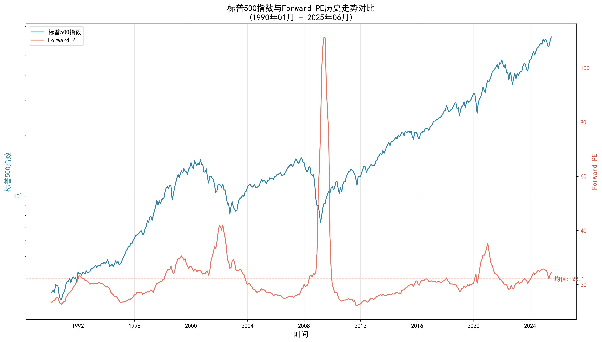
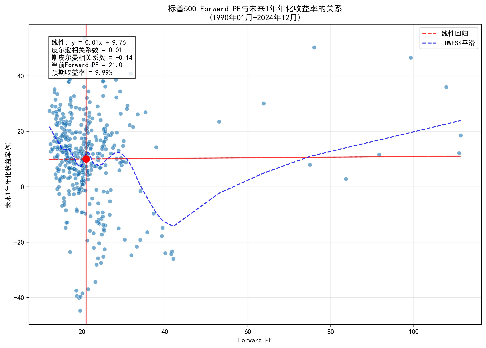
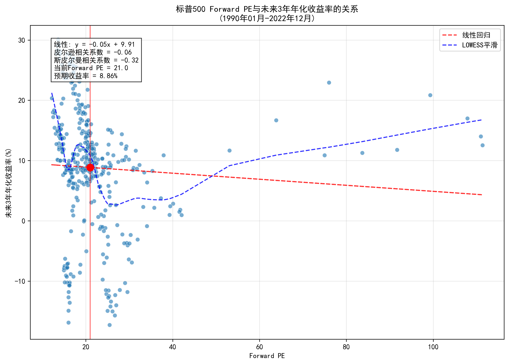
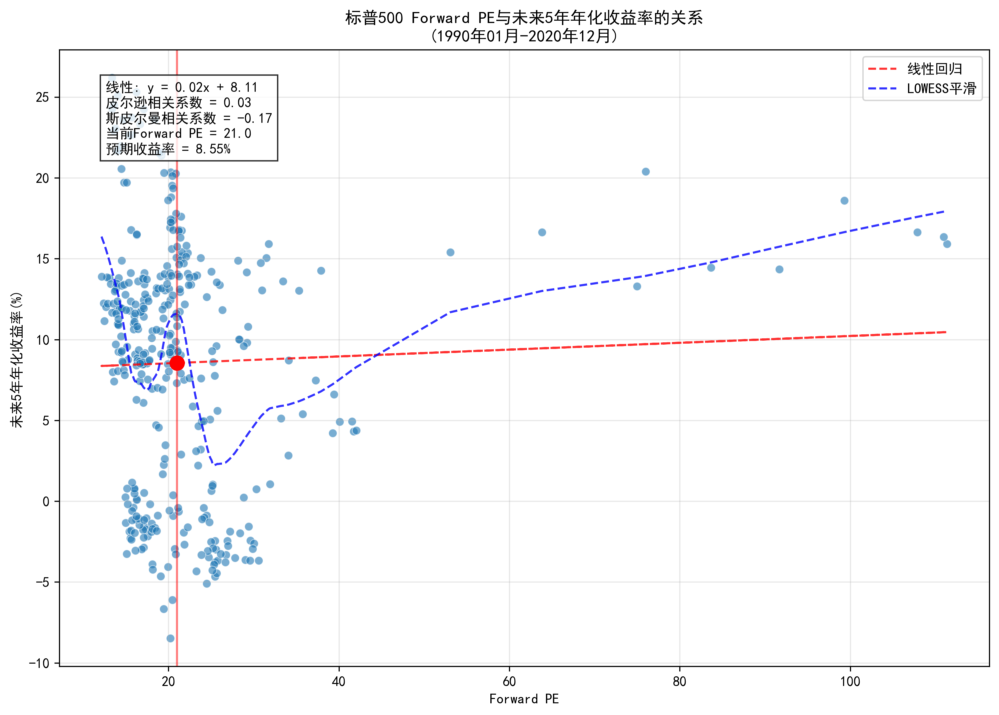
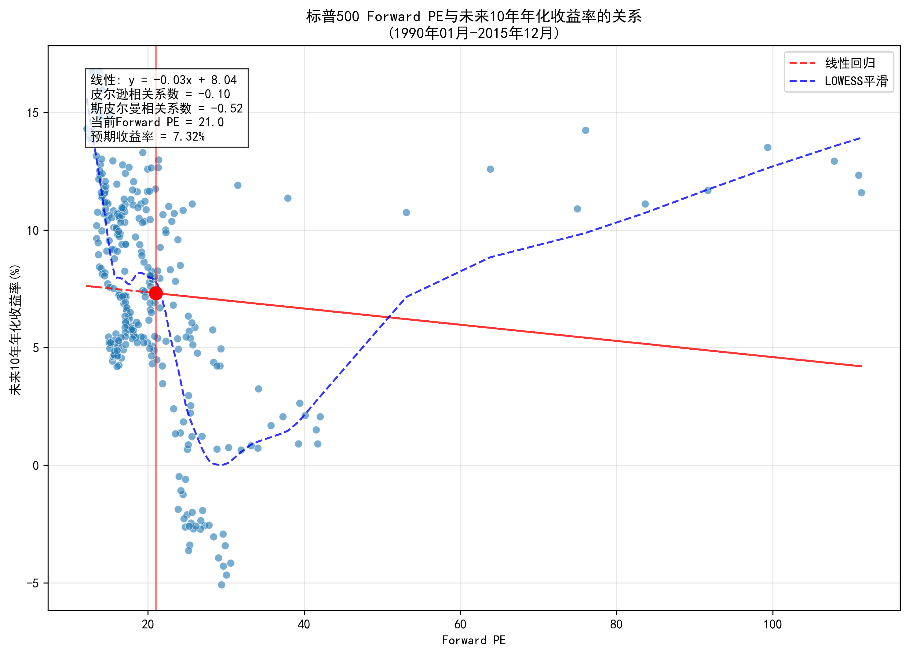
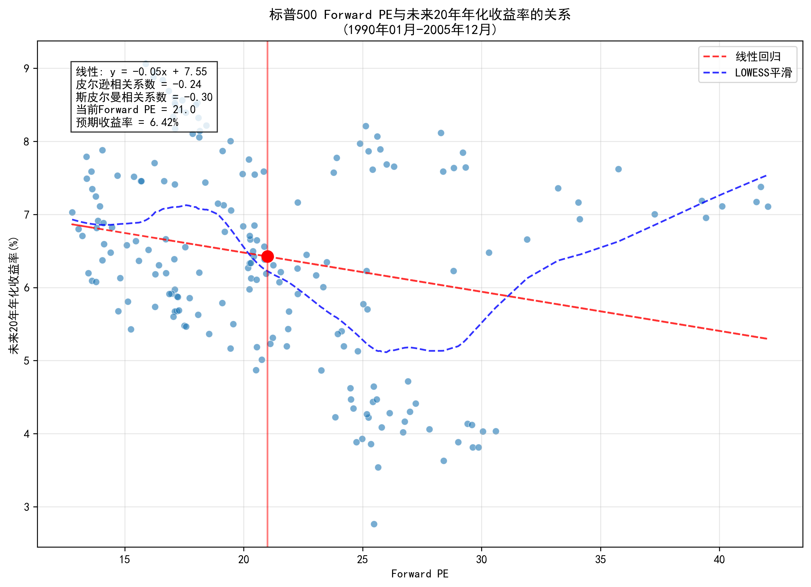

# 标普500 Forward PE与未来收益率分析报告

## 数据范围概览

### 各期数据统计
1. **1年期**：1990年01月 至 2024年12月（420个数据点）
2. **3年期**：1990年01月 至 2022年12月（396个数据点）
3. **5年期**：1990年01月 至 2020年12月（372个数据点）
4. **10年期**：1990年01月 至 2015年12月（312个数据点）
5. **20年期**：1990年01月 至 2005年12月（192个数据点）

## 当前市场估值

- 当前Forward PE：21.0
- Forward PE百分位：60.2%
- 历史Forward PE区间：12.2 - 111.4
- Forward PE均值：22.1
- Forward PE中位数：20.1

## Forward PE与CAPE的区别

| 指标 | Forward PE | CAPE (席勒市盈率) |
|------|-----------|------------------|
| 定义 | 当前价格 / 未来12个月预期盈利 | 当前价格 / 过去10年平均通胀调整盈利 |
| 时间视角 | 前瞻性 | 回顾性 |
| 优点 | 反映市场对未来的预期 | 平滑经济周期影响，更稳定 |
| 缺点 | 预期可能不准确 | 可能滞后于结构性变化 |
| 适用场景 | 短期估值判断 | 长期估值比较 |

## 各期限Forward PE与收益率相关性分析

### 1年期（1990年01月 - 2024年12月）
- 皮尔逊相关系数：0.01
- 斯皮尔曼相关系数：-0.14
- 线性回归方程：y = 0.01x + 9.76
- R²值：0.00
- 预期收益率：10.0%

### 3年期（1990年01月 - 2022年12月）
- 皮尔逊相关系数：-0.06
- 斯皮尔曼相关系数：-0.32
- 线性回归方程：y = -0.05x + 9.91
- R²值：0.00
- 预期收益率：8.9%

### 5年期（1990年01月 - 2020年12月）
- 皮尔逊相关系数：0.03
- 斯皮尔曼相关系数：-0.17
- 线性回归方程：y = 0.02x + 8.11
- R²值：0.00
- 预期收益率：8.6%

### 10年期（1990年01月 - 2015年12月）
- 皮尔逊相关系数：-0.10
- 斯皮尔曼相关系数：-0.52
- 线性回归方程：y = -0.03x + 8.04
- R²值：0.01
- 预期收益率：7.3%

### 20年期（1990年01月 - 2005年12月）
- 皮尔逊相关系数：-0.24
- 斯皮尔曼相关系数：-0.30
- 线性回归方程：y = -0.05x + 7.55
- R²值：0.06
- 预期收益率：6.4%

## Forward PE分位与收益率分析

### 低Forward PE时期（25%分位以下）vs 高Forward PE时期（75%分位以上）的平均收益率

#### 5年期
- 低PE时期平均收益率：10.7%
- 高PE时期平均收益率：4.9%
- 收益率差异：5.8%

#### 10年期
- 低PE时期平均收益率：10.0%
- 高PE时期平均收益率：2.7%
- 收益率差异：7.3%

#### 20年期
- 低PE时期平均收益率：6.9%
- 高PE时期平均收益率：5.7%
- 收益率差异：1.2%

## 结论

1. **Forward PE与未来收益率的预测能力**：
   - 短期（1-3年）：Forward PE对短期收益的预测能力较弱，市场短期走势受多种因素影响
   - 中期（5-10年）：开始显示一定的负相关关系，高估值倾向于带来较低的未来收益
   - 长期（10-20年）：Forward PE对长期收益有一定的预测作用

2. **Forward PE vs CAPE**：
   - Forward PE更关注市场对未来的预期，适合判断短期市场情绪
   - CAPE更稳定，对长期收益的预测能力通常更强
   - 两者结合使用可以获得更全面的估值视角

3. **当前市场状况**：
   - 当前Forward PE处于历史60%分位
   - 基于历史关系，预期未来10年年化收益率约为7.3%

4. **投资建议**：
   - 低Forward PE时期的投资回报普遍优于高Forward PE时期
   - 投资者应结合多个估值指标（Forward PE、CAPE、股息收益率等）进行综合判断
   - 估值只是投资决策的一个因素，还需考虑宏观经济、利率环境等

## 数据可视化

### 标普500指数与Forward PE历史走势对比

### Forward PE与未来1年收益率关系

### Forward PE与未来3年收益率关系

### Forward PE与未来5年收益率关系

### Forward PE与未来10年收益率关系

### Forward PE与未来20年收益率关系

## 数据来源
- 标普500价格数据：Yahoo Finance
- Forward PE数据：基于Shiller数据库的盈利数据计算
- 数据频率：月度数据
- 收益率计算：使用几何平均年化收益率
- 注意：历史Forward PE为估算值，基于历史盈利增长率计算预期盈利

