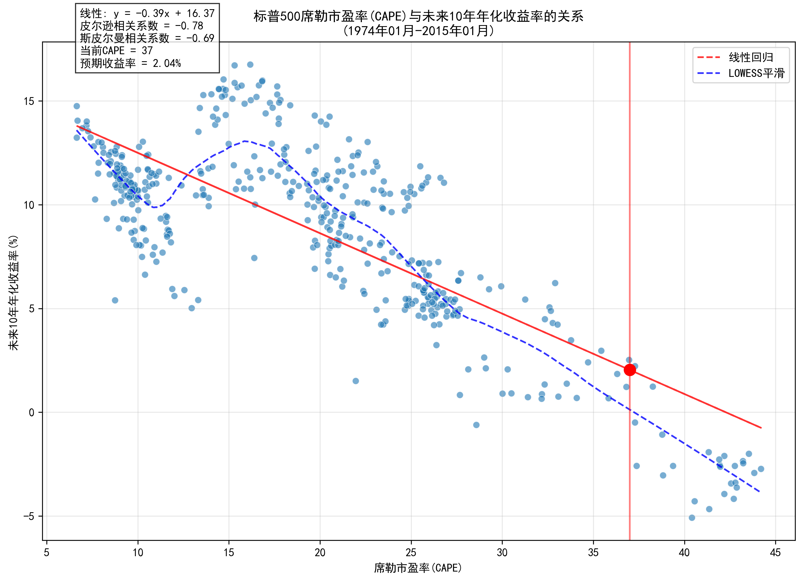

# 标普500席勒市盈率(CAPE)与未来收益率分析报告

## 1. 研究概述
本研究分析了标普500的席勒市盈率(CAPE)与未来1年、3年、5年和10年年化收益率之间的关系，数据范围从{start_date}到{end_date}。

## 2. 数据可视化

### 2.1 CAPE与未来1年收益率关系

- 相关系数：{correlation_1y:.4f}
- 趋势线方程：{equation_1y}
- R²值：{r_squared_1y:.4f}
- 当前CAPE(37)对应的预期收益率：{predicted_return_1y:.2f}%

### 2.2 CAPE与未来3年收益率关系

- 相关系数：{correlation_3y:.4f}
- 趋势线方程：{equation_3y}
- R²值：{r_squared_3y:.4f}
- 当前CAPE(37)对应的预期收益率：{predicted_return_3y:.2f}%

### 2.3 CAPE与未来5年收益率关系

- 相关系数：{correlation_5y:.4f}
- 趋势线方程：{equation_5y}
- R²值：{r_squared_5y:.4f}
- 当前CAPE(37)对应的预期收益率：{predicted_return_5y:.2f}%

### 2.4 CAPE与未来10年收益率关系

- 相关系数：{correlation_10y:.4f}
- 趋势线方程：{equation_10y}
- R²值：{r_squared_10y:.4f}
- 当前CAPE(37)对应的预期收益率：{predicted_return_10y:.2f}%

## 3. 相关性分析

### 3.1 相关系数计算方法
- 使用皮尔逊相关系数(Pearson Correlation)计算
- 计算公式：r = Cov(X,Y) / (σx * σy)
- 其中，Cov(X,Y)是CAPE和收益率的协方差，σx和σy分别是它们的标准差
- 相关系数范围：[-1, 1]，-1表示完全负相关，1表示完全正相关

### 3.2 不同时期相关性比较
1. **1年期**：
   - 相关系数：{correlation_1y:.4f}
   - R²值：{r_squared_1y:.4f}（解释力：{r_squared_1y:.1%}）
   - 预期收益率：{predicted_return_1y:.2f}%

2. **3年期**：
   - 相关系数：{correlation_3y:.4f}
   - R²值：{r_squared_3y:.4f}（解释力：{r_squared_3y:.1%}）
   - 预期收益率：{predicted_return_3y:.2f}%

3. **5年期**：
   - 相关系数：{correlation_5y:.4f}
   - R²值：{r_squared_5y:.4f}（解释力：{r_squared_5y:.1%}）
   - 预期收益率：{predicted_return_5y:.2f}%

4. **10年期**：
   - 相关系数：{correlation_10y:.4f}
   - R²值：{r_squared_10y:.4f}（解释力：{r_squared_10y:.1%}）
   - 预期收益率：{predicted_return_10y:.2f}%

### 3.3 相关性随时间的变化
- 短期（1年）相关性较弱，说明CAPE对短期收益的预测能力有限
- 中期（3-5年）相关性逐渐增强，预测能力提升
- 长期（10年）相关性最强，表明CAPE更适合用于长期收益预测

## 4. 当前市场分析
1. **当前CAPE水平**：
   - CAPE = 37，处于历史{cape_percentile:.1f}%分位
   - 历史范围：最低{cape_min:.2f}，最高{cape_max:.2f}
   - 历史均值：{cape_mean:.2f}
   - 历史中位数：{cape_median:.2f}

2. **预期收益率**：
   - 1年期：{predicted_return_1y:.2f}%
   - 3年期：{predicted_return_3y:.2f}%
   - 5年期：{predicted_return_5y:.2f}%
   - 10年期：{predicted_return_10y:.2f}%

## 5. 投资启示
1. **时间周期的重要性**：
   - CAPE对短期收益的预测能力较弱
   - 投资周期越长，CAPE的预测价值越高
   - 建议将CAPE作为长期投资决策的参考指标

2. **当前市场启示**：
   - 当前CAPE处于历史高位，暗示长期收益率可能低于历史平均
   - 短期波动可能较大，不适合用CAPE进行短期市场时机选择
   - 建议采用定投策略，分散投资时点风险

## 6. 注意事项
1. 这是历史统计关系，不能保证未来一定会重复
2. 投资决策不应仅基于CAPE，还需考虑其他因素
3. 这个关系更适合长期投资决策参考，不适合短期市场时机选择
4. 当前的高CAPE可能反映了特殊的市场环境（如低利率、高科技占比等）

## 7. 数据来源
- 标普500数据：Yahoo Finance
- CAPE数据：Robert Shiller数据库
- 数据频率：月度数据
- 收益率计算：使用几何平均年化收益率 